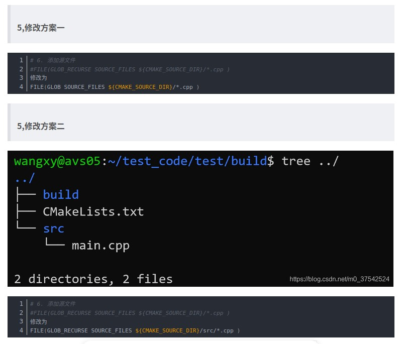

# Table of Contents
=================

   * [Table of Contents](#table-of-contents)
   * [Upgarde the Latest CMake on Ubuntu](#upgarde-the-latest-cmake-on-ubuntu)
      * [Use Snappyy](#use-snappyy)
      * [Install from source](#install-from-source)
      * [Reference](#reference)
   * [C/C++ Porject by CMake](#cc-porject-by-cmake)
      * [Reference](#reference-1)
   * [CMake for Cross Platform](#cmake-for-cross-platform)
      * [Reference](#reference-2)
   * [Visual Studio vs. VSCode and CMake](#visual-studio-vs-vscode-and-cmake)
      * [Reference](#reference-3)   
   * [Reference](#reference-4)


# Upgarde the Latest CMake on Ubuntu  

## Use Snappyy  
Remove old version  
```
sudo apt remove --purge cmake
hash -r
```

```
sudo snap install cmake --classic

cmake --version
```

## Install from source  
```
sudo apt install build-essential libssl-dev
wget https://github.com/Kitware/CMake/releases/download/v3.20.2/cmake-3.20.2.tar.gz
tar -zxvf cmake-3.20.2.tar.gz
cd cmake-3.20.2
./bootstrap
make 
sudo make install 
```

## Reference  
[Installing the Latest CMake on Ubuntu Linux Aug 28, 2023](https://graspingtech.com/upgrade-cmake/)

# C/C++ Porject by CMake 

## Reference  
[建構屬於自己的C/C++專案 : 我的30天CMake學習之旅 2023-09-15](https://ithelp.ithome.com.tw/users/20162026/ironman/6715)  
[ [Day 20] 使用第三方庫--以OpenCV為例 2023-10-04](https://ithelp.ithome.com.tw/articles/10334379)  
[ [Day 21] 使用第三方庫--以json為例 2023-10-05](https://ithelp.ithome.com.tw/articles/10335066)  
[m11112089/2023_iT_CMake.git](https://github.com/m11112089/2023_iT_CMake.git)  

# CMake for Cross Platform  

## Reference  
[30 天 CMake 跨平台之旅 2023-09-01](https://ithelp.ithome.com.tw/users/20161950/ironman/6278?page=1)
[erichung0404/cmake-example](https://github.com/erichung0404/cmake-example)    

# Visual Studio vs. VSCode and CMake  
Visual Studio  | CMake 
------------------------------------ | --------------------------------------------- 
language standard | set(CMAKE_CXX_STANDARD 17)
output directory | install
additional include directories | target_include_directories
additional library directories | target_link_directories
additional dependencies | target_link_libraries
macro settings | target_compile_definitions

settings.json
```
{
  "cmake.buildDirectory": "${workspaceFolder}/build",
  "cmake.installPrefix": "${workspaceFolder}/build/install",
  "cmake.configureArgs": []
}
```

tasks.json
```
{
	"version": "2.0.0",
	"tasks": [
    {
      "type": "cmake",
      "label": "CMake: install",
      "command": "install"
    }
  ]
}
```

launch.json
```
{
  "version": "0.2.0",
  "configurations": [
    {
      // for Windows
      "name": "(msvc) Launch",
      "type": "cppvsdbg",
      "request": "launch",
      "program": "${command:cmake.launchTargetPath}",
      "args": [],
      "cwd": "${workspaceFolder}",
      "preLaunchTask": "CMake: install"
    },
    {
      // for Linux
      "name": "(gdb) Launch",
      "type": "cppdbg",
      "request": "launch",
      "program": "${command:cmake.launchTargetPath}",
      "args": [],
      "cwd": "${workspaceFolder}",
      "preLaunchTask": "CMake: install"
    }
  ]
}
```

## Reference  
[Visual StudioでC++書く人向けのvscode&CMake乗り換えメモ 2023-09-30](https://qiita.com/husty530/items/ba74386a64a87631ef8e)  


# multiple definition of `main'  


##  Reference  
[multiple definition of `main' 2020-02-20](https://blog.csdn.net/m0_37542524/article/details/104409600)  


# Reference 
[CMakeの使い方（その１）2022-03-25](https://qiita.com/shohirose/items/45fb49c6b429e8b204ac)  
[CMakeの使い方（その２）2022-03-27](https://qiita.com/shohirose/items/637f4b712893764a7ec1)  
[CMakeの使い方（その３）2022-03-27](https://qiita.com/shohirose/items/d2b9c595a37b27ece607)  
[【初心者向け】CMakeLists.txtを使ってビルドする。2023-06-13](https://qiita.com/hi_to_san/items/490f8320900617db9230)  
[【初心者向け】CMakeLists.txtを使ってincludeのpathを省略する 2023-06-13](https://qiita.com/hi_to_san/items/00a5e9a75a8876b39492)  
[【初心者向け】CMakeLists.txtを使ってlibraryをリンクする。2023-06-13](https://qiita.com/hi_to_san/items/2b44dd44d3e152594c53)  
