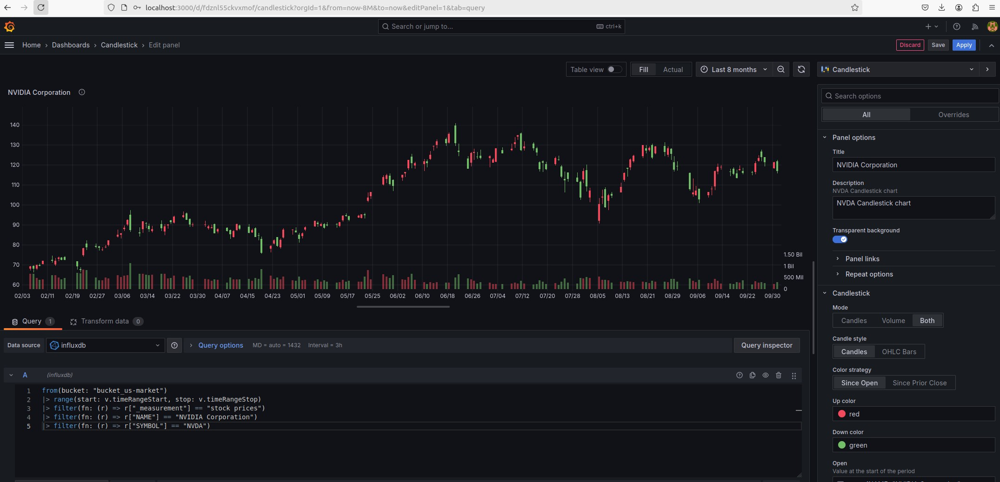
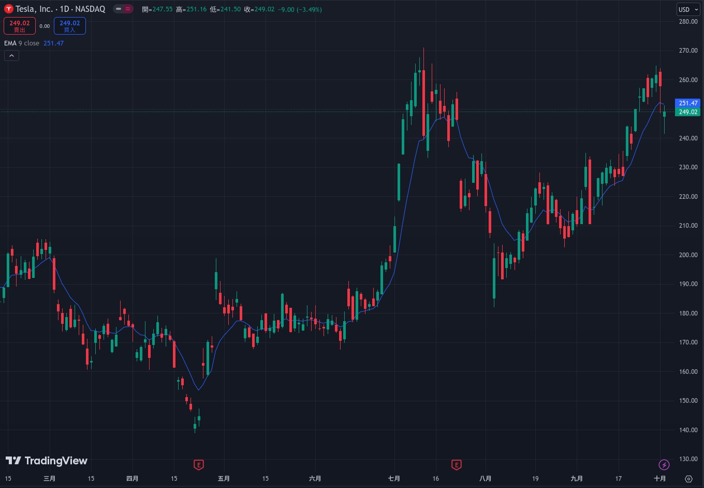
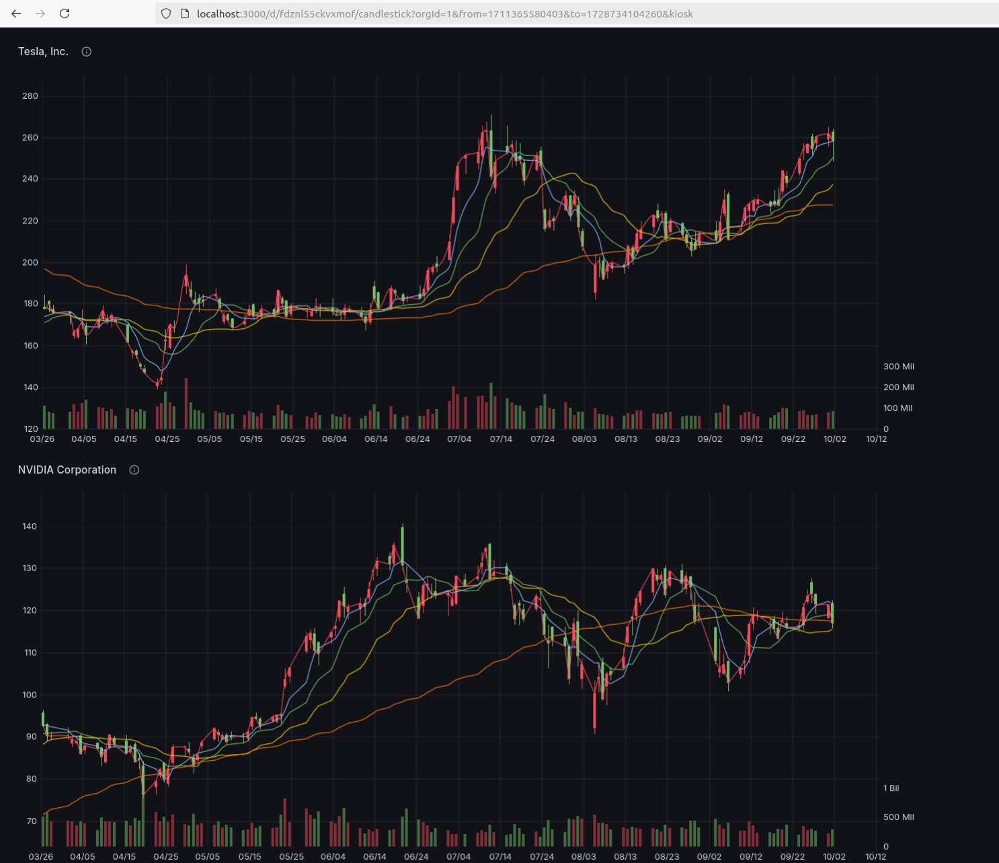
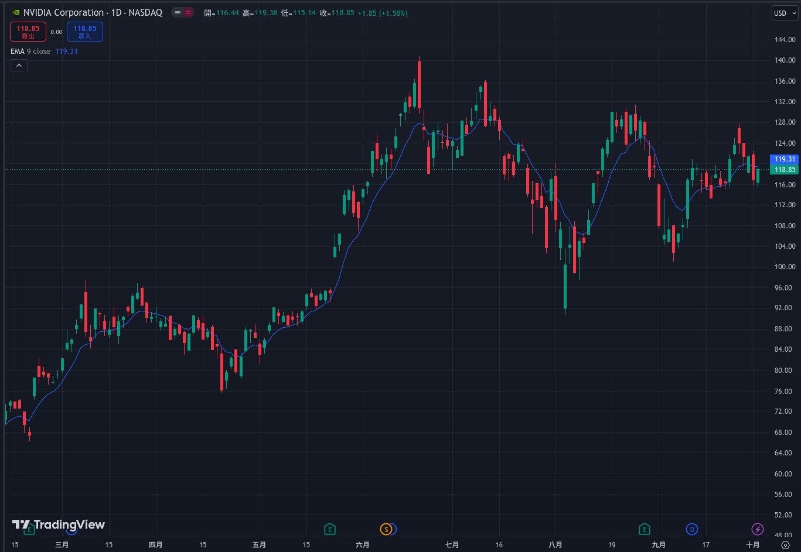

Table of Contents
=================

   * [Table of Contents](#table-of-contents)
   * [InfluxDB](#influxdb)
      * [InfluxDB Installation](#influxdb-installation)               
      * [Grafana Installation](#grafana-installation)                     
      * [Dashboard Setup](#dashboard-setup)                     
         * [Reference](#reference)  
      * [DataSet Insertation](#dataset-insertation)                
         * [Tesla and NVIDIA CandleStick Chart](#tesla-and-nvidia-candlestick-chart)
         * [TSLA Trading View](#tesla-trading-view)
         * [TSLA and NVDA Grafana View](#tsla-and-nvda-grafana-view)
         * [NVDA Trading View](#nvda-trading-view)   
         * [Reference](#reference-1)   
      * [Reference](#reference-2)  
   * [Grafana](#grafana)  
      * [Reference](#reference-3) 
   * [Prometheus](#prometheus)  
      * [Reference](#reference-4) 
   * [OpenTSDB](#opentsdb) 
      * [Reference](#reference-5)
   * [Troubleshooting](#troubleshooting)
   * [Reference](#reference-6)
   * [h1 size](#h1-size)
      * [h2 size](#h2-size)
         * [h3 size](#h3-size)
            * [h4 size](#h4-size)
               * [h5 size](#h5-size)
   * [Table of Contents](#table-of-contents-1)

Created by [gh-md-toc](https://github.com/ekalinin/github-markdown-toc)


# InfluxDB  

## InfluxDB Installation  
```
localhost:8086にアクセスします。
```

  

  

```
Grafana, Proxmoxでは以下の情報が必要になります。

    Organizationの名前
    APIトークン
    バケットの名前
```

  

```
画像のように{ユーザー名}'s Tokenという項目があるので、名前をクリックするとトークンが表示されます。

COPY TO CLIPBOARDを押すとコピーできるのでメモしておいてください。
```

## Grafana Installation  
```
localhost:3000にアクセスする

username: admin
password: admin
```

  

```
Query Language をInfluxQL からFlux に変更することです。
```

```
URLについてはcomposeで定義したサービス名を使用してください。
```

  

```
Fluxに変更した状態で画像のように残りのフォームを埋めます。
```
  

## Dashboard Setup  
```
Import via grafana.comの入力欄に先ほどコピーしたIDを入力してLoadしてください。
```
  


```
OptionsのデータソースからInfluxDBを選択してImportを押します。
```
  

  

[GrafanaとInfluxDBで作るProxmoxダッシュボード【Docker】 Docker proxmox influxdb grafana 可視化](https://qiita.com/rokuosan/items/a378e46a89d31d544d4d)  

Name | Version
------------------------------------ | --------------------------------------------- 
Proxmox VE | 7.2-7
Ubuntu | 22.04.1 LTS
Docker | 20.10.17
Docker Compose | v2.6.0
Grafana | 9.1.8
InfluxDB | v2.4.0

[docker_compose_rokuosan.yml](docker_compose/docker_compose_rokuosan.yml)  
[docker-compose_shazforiot.yml](docker_compose/docker-compose_shazforiot.yml)  


### Reference  
[[01] docker-compose で influxdb 2.0 + grafana を立ち上げる ... 🔥失敗🔥 influxdb grafana influxdb2 2021-08-16](https://qiita.com/robozushi10/items/a0e8b3de1b9a9628f751)  
[docker_compose_robozushi10.yml](docker_compose/docker_compose_robozushi10.yml)
[robozushi10/qiita-influxdb-docker/influxdb-2.0](https://github.com/robozushi10/qiita-influxdb-docker/tree/master/influxdb-2.0)  

[Grafana Influxdb Tutorial | Grafana Influxdb Docker Compose YAML Dec 14, 2020](https://www.youtube.com/watch?v=rRKDfU4tmJQ&ab_channel=Thetips4you)  
[shazforiot/grafana_influxdb-docker-compose ](https://github.com/shazforiot/grafana_influxdb-docker-compose)  
[docker-compose_shazforiot.yml](docker_compose/docker-compose_shazforiot.yml) 

[[02] docker-compose で influxdb 1.8 + grafana を立ち上げる influxdb grafana influxdb2 2021-08-16](https://qiita.com/robozushi10/items/d29b255fec94e4fdde2f)  
No  | サービス  | ホスト側ポート  | コンテナ側ポート  | 	備考
------------------------------------ | --------------------------------------------- | ----------------------------------- | --------------------------------------------- | ----------------------------------- 
1  | grafana  | 3000  | 3000  | 
2  | influxdb  | 8086   | 8086  | WEBブラウザから 8086 にアクセスしても「404」エラーになるので、下記「Chronograf」を使う.
3  | Fluentd  | 44224  | 44224  | 本記事の趣旨とは無関係であるが、使用していたので載せているだけである
4  | Chronograf  | 8888  | 8888  | influxdb を GUI で操作するためのソフトの模様. influxdb 2.0 であれば不要なような気がする.

[robozushi10/qiita-influxdb-docker/influxdb-1.8](https://github.com/robozushi10/qiita-influxdb-docker/tree/master/influxdb-1.8)  


[fluentdのプラグインを公式DockerイメージでインストールするときはRootユーザーで実行しよう  2019-08-07](https://qiita.com/tamanobi/items/a57f2802c7fd1236ea52)  


[InfluxDB2.0+Grafana+Telegrafの構築 influxdb grafana Telegraf 2021-12-18](https://qiita.com/sammrai/items/0c329ac7aa8b100b66a8)  
```
確認環境
    docker 19.03.8
    docker-compose 1.26.0
    os ubuntu20
```
[docker_compose.yml](docker_compose/sammrai/docker_compose.yml)  
[telegraf.conf](docker_compose/sammrai/telegraf.conf)  

[ローソク足を自炊してGrafanaで描画してみた influxdb grafana Telegraf 仮想通貨 2024-05-03](https://qiita.com/sammrai/items/b9ab6246c72b3b527126)  
[sammrai/fetch_ohlcv Commits on Aug 21, 2024](https://github.com/sammrai/fetch_ohlcv)  

  

[makaveli10 / StockPrediction_Transformer ](https://github.com/makaveli10/StockPrediction_Transformer)  
```
Intra day Stock Prediction 10 minutes into the future 
```

[Docker コンテナの監視ツールについて zabbix Docker influxdb grafana prometheus 2020-11-21](https://qiita.com/yokra9/items/1e48ea2492ed00c2c38f)  

[#1 「Confluent + InfluxDB + Grafana 」 で IoTデータをストリーミング処理後に可視化してみました influxdb grafana Kafka confluent Connector  2021-08-10](https://qiita.com/turupon/items/e637ded0a42806b4e901) 

サービス名 | 変更有無 | 内容
------------------------------------ | --------------------------------------------- | ----------------------------------- 
zookeeper | 無 | 	
broker | 無 | 
schema-registry | 無 | 
connect | 有 | 使用イメージ変更
control-center | 無 | 	
ksqldb-server | 無 | 
ksqldb-cli | 無 | 
rabbitmq | 無 | 
influxdb | 有 | 新規追加
grafana | 有 | 新規追加

[docker_compose_turupon.yml](docker_compose/docker_compose_turupon.yml)

[#2 「Confluent + InfluxDB + Grafana 」 で IoTデータをストリーミング処理後に可視化してみました influxdb grafana Kafka confluent Connector  2021-08-10](https://qiita.com/turupon/items/f0d98656dfdc29aed348)  
[#3 「Confluent + InfluxDB + Grafana 」 で IoTデータをストリーミング処理後に可視化してみました influxdb grafana Kafka confluent Connector  2021-08-26](https://qiita.com/turupon/items/7d1eb598e0291fb999da)  

  

```
Consumer側の可視化の構成を追加する形で確認します。
```

  


[Docker玩轉InfluxDB 2022-01-15](https://wenwender.wordpress.com/2022/01/15/docker%e7%8e%a9%e8%bd%89influxdb/)  
[Docker玩轉Grafana(feat. InfluxDB) 2022-01-18](https://wenwender.wordpress.com/2022/01/18/docker%e7%8e%a9%e8%bd%89grafanafeat-influxdb/)  
[Docker建立 BTC 即時價格Dashboard 2022-01-19](https://wenwender.wordpress.com/2022/01/19/docker%e5%bb%ba%e7%ab%8b-btc-%e5%8d%b3%e6%99%82%e5%83%b9%e6%a0%bcdashboard/)  

```
補充: (因為幣安的API請求到的資料是timestamp，這裡我們一律將其轉成datetime的格式)
	
datetime.datetime.fromtimestamp(ds[0]/ 1e3)
```

```
Grafana Dashboard

這裡一樣的步驟是，先到InfluxDB取得SQL語法，再把它貼到Grafana去，這裡我就不再示範，如果有忘記的可以去看這篇文 Docker玩轉Grafana，
有個小提醒是，記得要先去influxDB建立bucket，不然資料會insert不進去喔。

最後呈現的結果大概會像這樣，而且資料是會不斷的更新的。
```

[透過Grafana繪製即時BTC K線圖 2022-02-13](https://wenwender.wordpress.com/2022/02/13/%e9%80%8f%e9%81%8egrafana%e7%b9%aa%e8%a3%bd%e5%8d%b3%e6%99%82btc-k%e7%b7%9a%e5%9c%96-2/)
```
實作
傳送門
首先，需要先確認Grafana的版本>8.3，因為K線的Panel是Grafana在8.3版本後新增的功能。
第一步，仍然是要將BTC的資料寫進Influxdb裡，詳細的細節可以參考此篇文章 。
第二步，在Grafana中建立Panel(Candlestick)，並且建立搜索。
```
```
from(bucket: "cryptocurrency") |> range(start: v.timeRangeStart, stop: v.timeRangeStop) |> filter(fn: (r) => r["_measurement"] == "bitcoin") |> filter(fn: (r) => r["type"] == "5m")
```
```
大家在蒐集資料的時候，可能會有自己的measurement或type，記得要調整。
```

```
另外，我們也想要同時看到移動平均線。

Influxdb本身的Query就有支援Moving Average，因此我們只要再新增這段Query，就可以獲得以收盤價繪製的移動平均線。如果要畫m10或m20，只要修改movingAverage(n: n)的數字即可。
```
```
from(bucket: "cryptocurrency")  |> range(start: v.timeRangeStart, stop: v.timeRangeStop)  |> filter(fn: (r) => r["_measurement"] == "bitcoin")  |> filter(fn: (r) => r["_field"] == "close")  |> filter(fn: (r) => r["type"] == "$5m")  |> rename(columns: {_field: "m5"})  |> movingAverage(n: 5)
```


[InfluxDB記憶體耗用居高不下(踩雷筆記) 2022-01-27](https://wenwender.wordpress.com/2022/01/27/influxdb%e8%a8%98%e6%86%b6%e9%ab%94%e8%80%97%e7%94%a8%e5%b1%85%e9%ab%98%e4%b8%8d%e4%b8%8b%e8%b8%a9%e9%9b%b7%e7%ad%86%e8%a8%98/)  

```
整理一下InfluxDB和PostgresDB的差別和比較以及實際使用InfluxDB上遇到的問題。

   1. InfluxDB 針對時間序列進行了大量優化。所以當寫入量很大時可能不會遇到很多問題，它使用壓縮來使用更少的空間。
   2. InfluxDB 是為時間序列製作的 NOSQL 數據庫
   3. 刪除數據需要較高的耗能(No-SQL的特性)
   4. “InfluxDB 不支持 UPDATE 語句。但是，在相同時間戳重新插入完全相同的key值，此時將用新的值去代替舊的值。
   5. 儲存同樣數量的時間序列數據，與 PostgreSQL 相比，InfluxDB 僅使用約 1/4 的空間。
   6. 查詢大量數據時，InfluxDB被打爆(因為沒有Index)

問題一:記憶體耗用高
問題二:插入時間跨度長的數據會造成性能下降和內存耗盡
```
[Grafana實時呈現攝影機畫面 2022-01-28](https://wenwender.wordpress.com/2022/01/28/grafana%e5%af%a6%e6%99%82%e5%91%88%e7%8f%be%e6%94%9d%e5%bd%b1%e6%a9%9f%e7%95%ab%e9%9d%a2/)  

[python-binance](https://python-binance.readthedocs.io/en/latest/)  

[Paper Reading:利用CNN神經網路來交易ETF 2019-09-15](https://wenwender.wordpress.com/2019/09/15/%e8%ab%96%e6%96%87%e9%96%b1%e8%ae%80%e5%88%a9%e7%94%a8cnn%e7%a5%9e%e7%b6%93%e7%b6%b2%e8%b7%af%e4%be%86%e4%ba%a4%e6%98%93etf/)  
[實作:透過LSTM預測股票 2019-10-18](https://wenwender.wordpress.com/2019/10/18/%e5%af%a6%e4%bd%9c%e9%80%8f%e9%81%8elstm%e9%a0%90%e6%b8%ac%e8%82%a1%e7%a5%a8/)   

## DataSet Insertation  
[inject_stock_prices.py](inject_stock_prices.py)


[grap_taiwan_stock_list.py](grap_taiwan_stock_list.py)  
[init_influxdb.py](init_influxdb.py)  
[update_influxdb.py](update_influxdb.py)  

### Tesla and NVIDIA CandleStick Chart  
  

### TSLA Trading View  
  

### TSLA and NVDA Grafana View  
  

### NVDA Trading View  
  

### Reference  
[Cannot convert timezone for a timestamp in pandas Jul 21, 2022 ](https://stackoverflow.com/questions/73064425/cannot-convert-timezone-for-a-timestamp-in-pandas)  

[Understanding how to write pandas DF with tags, to influxDB #510 Sep 30, 2017](https://github.com/influxdata/influxdb-python/issues/510) 
[data frame with tag columns #286 Jan 26, 2016](https://github.com/influxdata/influxdb-python/issues/286)  
'''
   gte620V on Oct 2, 2017

   Sorry, I didn't look at the error closely before. Your problem is that the index is not a datetime index.

   You need to do some combination of pd.to_datetime and df.set_index to get your dataframe to have a datetimeindex. 
   You seem to have a column of string called index, which is not the same thing. 
   You need convert these strings to datetime objects with pd.to_datetime and then pass that column to df.set_index.
'''

[How do I properly set the Datetimeindex for a Pandas datetime object in a dataframe? Nov 20, 2014](https://stackoverflow.com/questions/27032052/how-do-i-properly-set-the-datetimeindex-for-a-pandas-datetime-object-in-a-datafr)  


[Python pandas dataframe to Influxdb with column and other tags August 6, 2020](https://www.mka.in/wp/python-pandas-dataframe-to-influxdb-with-column-and-other-tags/)  
[Python pandas dataframe into influxdb with tags August 6, 2020](https://www.youtube.com/watch?v=oB-lvuJlBd4)  

[Getting Started: InfluxDB 3.0 Python Client Library August 2, 2023](https://www.youtube.com/watch?v=tpdONTm1GC8)  

[sruon/telegraf-stocks Dec 20, 2016](https://github.com/sruon/telegraf-stocks)  
```
Retrieve Stock infos from Yahoo Finance in a format ready to consume for Telegraf - InfluxDB. 
```

[Automated Stock Trading Model Using InfluxDB Aug 22, 2022](https://www.influxdata.com/blog/automated-stock-trading-model-using-influxdb/)  
[Westonside/Influx-Intern-Project Jul 14, 2022](https://github.com/Westonside/Influx-Intern-Project)  

[Getting Started with Python and InfluxDB Jan 21st, 2022](https://thenewstack.io/getting-started-with-python-and-influxdb/)  
```
measurementName,tagKey=tagValue fieldKey1="fieldValue1",fieldKey2=fieldValue2 timestamp
```

[pandas.DatetimeIndex.tz_localize - PyData](https://pandas.pydata.org/docs/reference/api/pandas.Series.tz_localize.html)  

[Line protocol](https://docs.influxdata.com/influxdb/v2/reference/syntax/line-protocol/)
```
// Syntax
<measurement>[,<tag_key>=<tag_value>[,<tag_key>=<tag_value>]] <field_key>=<field_value>[,<field_key>=<field_value>] [<timestamp>]

// Example
myMeasurement,tag1=value1,tag2=value2 fieldKey="fieldValue" 1556813561098000000
```
```
Line protocol does not support the newline character \n in tag or field values.
```

[x01963815/grab-stocks-data-to-influxdb May 1, 2018](https://github.com/x01963815/grab-stocks-data-to-influxdb)
```
從 Google Finance 上抓取台灣上市公司股價資料，並且存入 InfluxDB 資料庫中

init_influxdb.ipynb：初始化InfluxDB股價資料庫
update_influxdb.ipynb：更新InfluxDB股價資料庫
```

[ファイナンス分野で時系列データベースinfluxDBを使う Python 時系列 Finance influxdb 2022-08-27](https://qiita.com/ixtlan001/items/c87e4b2c4a97d7dba800)  

[ファイナンス分野でInfluxDB+Grafanaを使う（株価をローソク足表示） Python 時系列解析 Finance influxdb grafana 2022-08-27](https://qiita.com/ixtlan001/items/268dfab0d1ee21887602)  
```
データソースの追加(influxDBとの連携設定)

GrafanaのConfigurationメニュー→"Data sources"→"Add data source"をクリック。
下記項目を入力して"Save & test"をクリック。

    "Query Language" : "Flux"を選択
    "URL" : http://influxdb:8086
    "Basic Auth Details"のUserとPassword : influxDBのユーザー名とパスワード
    "Organization" : influxDBで登録しているorganization名
    "Token" : influxDBのAPI Tokenをコピ
```

```
Dashboard作成

画面左側のメニューからDashboards→New dashboard→Add a new panelを順に辿る。

query入力部分にFlux（influxDBのクエリ言語）で例えば下記を入力（Fordの株価の場合）:

from(bucket: "influxdb_stock_prices")
|> range(start: v.timeRangeStart, stop: v.timeRangeStop)
|> filter(fn: (r) => r["_measurement"] == "stock prices")
|> filter(fn: (r) => r["NAME"] == "ford")
|> filter(fn: (r) => r["SYMBOL"] == "F")

画面上部の時計マークの所をクリックしてFromをnow-2M、ToをnowにしてApply Time Rangeをクリック。

右上のパネルのタイプとして"Time series"が選ばれている所のドロップダウンメニューから"Candlestick"を選択。
```

```
Bollinger Band等の表示

以下はinfluxdbの_fieldにOHLCV以外の"Upper Bollinger Band"、"Lower Bollinger Band"が入っていることを前提としています。

    "Additional fields"で"Include"を選択
    "Point size"を1に変更（これはお好みで）

ここまででとりあえずOHLCV以外の線が表示されます。

    線の下を不透明にする
        "+ Add field override"をクリック
        "Fields with name"を選択
        "Upper Bollinger Band(base field name)"を選択
        "+ Add override property"で"Graph styles > Fill Opacity"を選択して20程度に設定
        "+ Add override property"で"Standard options > Color scheme"を選択して"Single color"を選択、右端のカラーパレット（default黒になってて見にくいです）で好みの色を選択

同様のことをLower Bollinger Bandに対しても繰り返します。
```

```
Legendテキストの変更

デフォールトではLegendに使われるテキストラベルが長たらしいので下記で変更できます。

    パネルのEdit画面で"Overrides"タブを開く。
    Add field overrideをクリック
    Fields with nameを選択
    変更したい変数を選択
    Add override propertyで"Standard options > Display name"を選択
    新しいテキストラベルを入力
```

[influxdb-flux-change-or-alias-legend-label-from-temp-host-xx-topic-yy-just-to-yy](https://community.grafana.com/t/influxdb-flux-change-or-alias-legend-label-from-temp-host-xx-topic-yy-just-to-yy/49596)  


[influxdb+grafanaで変数を利用して個別の株価パネルを複製  Python 時系列解析 Finance influxdb grafana 2022-08-28](https://qiita.com/ixtlan001/items/7ba21c1f94fc4547fcca)  
[Influxdb 2.0 how to get a tag all values? Apr 25, 2020](https://stackoverflow.com/questions/61424275/influxdb-2-0-how-to-get-a-tag-all-values)  

[InfluxDB v2 (OSS版) PythonクライアントでInfluxdbの気象データを取得する Python SQL PostgreSQL influxdb 2024-01-31](https://qiita.com/pipito-yukio/items/0b1c8234a3467a9b98e8)  

[RaspberryPiでセンサーデータの可視化(1) InfluxDBとGrafanaを使う 2024/09/07](https://zenn.dev/kiyokiyo/articles/ae29bbbbefd24c)  
 


## Reference  

[Distributed-System-Spark](https://github.com/aaron1aaron2/NCCU_110-2_Distributed-System-Spark_final?tab=readme-ov-file)  
```
本專案以Spark-MLlib API實現爬蟲資料缺失自動補救機制，先透過FinMind API爬取每日股票，將資料存入Influx Database，
當爬蟲部分出現錯誤而無法依序取得資料時，系統將自動呼叫MLlib API存取Database資料並進行預測，再將預測結果寫回Database，
最後以Plotly API 和 Dash API進行資料視覺化比較有補救與未補救的差異，以下為我們整體專案的介紹和相關API的安裝流程。
```

[MarkhamLee/internet-and-iot-data-platform Commits on Sep 16, 2024](https://github.com/MarkhamLee/internet-and-iot-data-platform)  
```
Using Airflow, Grafana, InfluxDB, Node-RED & Postgres to bring together useful information from a variety of sources, 
e.g., finance, weather, task management and IoT devices 
```
[sruon/telegraf-stocks Jan 27, 2022](https://github.com/sruon/telegraf-stocks)  
```
Retrieve Stock infos from Yahoo Finance in a format ready to consume for Telegraf - InfluxDB.
```
[hilli/finance-influxdb Aug 27, 2020](https://github.com/search?q=InfluxDB++finance&type=repositories)
```
Daemon that will import Equity (Stocks) data from Yahoo Finance and insert it into InfluxDB
```
[11harini04/StockTick Jun 23, 2021](https://github.com/11harini04/StockTick)  
```
Scraping stock data of Neyveli India Limited (NLCINDIA) from Yahoo Finance for storing it in InfluxDB, querying and forecasting the prices of the stock for the upcoming days. 
STEPS:
   1. Web Scraping data from Yahoo Finance.
   2. Since stock data is time series data, it is inserted into InfluxDB, which is a time series database.
   3. Data is queried and forecasted using the following models:
      Autoregressive integrated moving average (ARIMA)
      Long Short Term Memory (LSTM)
   4. Smoothing using Moving Average to identify trends in the stock.
   5. Risk analysis was done on the stock by finding the Sharpe ratio and Sortino ratio of the stock.
```

[InfluxDBについて最初に知るべき10のこと 2017-12-04](https://qiita.com/nmrmsys/items/cdeb4afa76c591acfd3f)  
```
#InfluxDBサーバコンテナ作成
docker run --name=influxdb -d -p 8086:8086 -p 8083:8083 -e INFLUXDB_ADMIN_ENABLED=true influxdb:1.2

#上記コンテナに入るとCLIが使用可能
docker exec -it influxdb bash
influx -precision rfc3339

#Web管理UIにはポート8083でアクセス
<お好みのブラウザ> http://localhost:8083

#InfluxDBサーバ停止
docker stop influxdb

#InfluxDBサーバ開始
docker start influxdb

#InfluxDBサーバコンテナ削除
docker rm influxdb
```
```
SHOW DATABASES
CREATE DATABASE testdb
USE testdb
DROP DATABASE testdb

SHOW MEASUREMENTS
DROP MEASUREMENT tbl1 

SELECT * FROM tbl1
INSERT tbl1,tag1='a' fld1=1
DELETE * FROM tbl1

SHOW TAG KEYS FROM tbl1
SHOW TAG VALUES FROM tbl1 WITH KEY = tag1
SHOW FIELD KEYS FROM tbl1

SHOW SERIES FROM tbl1
DROP SERIES FROM tbl1 WHERE tag1 = 'a'
```
```
SELECT <function>(<field_key>)
FROM_clause
WHERE <time_range>
GROUP BY time(<time_interval>,<offset_interval>),[tag_key] [fill(<fill_option: null/numeric/linear/none/previous>)]

SELECT MAX(water_level)
FROM h2o_feet
WHERE time >= '2015-09-18T16:00:00Z' AND time <= '2015-09-18T16:42:00Z'
GROUP BY time(12m,3m),location fill(0)
```
[HTTPS Setup](https://docs.influxdata.com/influxdb/v1.3/administration/https_setup/)  
```
etc/influxdb/influxdb.conf

[http]  
  https-enabled = true
  https-certificate = "server.crt"
  https-private-key = "server.key"
```


[InfluxDB 3.0 Python Client](https://github.com/InfluxCommunity/influxdb3-python)  
[influxdb-client-python](https://github.com/influxdata/influxdb-client-python)  
```
This repository contains the Python client library for use with InfluxDB 2.x and Flux
```
[gusutabopb/aioinflux  Aug 5, 2023](https://github.com/gusutabopb/aioinflux)
```
Asynchronous Python client for InfluxDB

For InfluxDB v2+ support, please use the official Python client library.

Asynchronous Python client for InfluxDB. Built on top of aiohttp and asyncio. 
Aioinflux is an alternative to the official InfluxDB Python client.
```
[AdvancedClimateSystems/inflow Commits on Jan 24, 2024](https://github.com/AdvancedClimateSystems/inflow)  
```
Simple python InfluxDB client library

A simple InfluxDB Python client library. It is an alternative for the official InfluxDB Python client library.

Inflow officially supports Python 2.7 and up, but the latest Python 3 version is recommended.
InfluxDB is supported from version 1.0 and up.
```
[wuan/klimalogger Commits on Jan 28, 2024](https://github.com/wuan/klimalogger)
```
a climate sensor logger client for a InfluxDB backend written in python
```

[RaspberryPi4 influxDBとGrafana編 RaspberryPi influxdb grafana 2023-05-05](https://qiita.com/kanon700/items/e3a8a1cea4bcd635a002)  

[Raspberry Pi上のInfluxDBに格納したデータをGrafanaで可視化する（Chronografとの比較も）RaspberryPi influxdb grafana IoT Chronograf 2020-05-29](https://qiita.com/yoroyasu/items/5893849a896aec6da25c)  

[Rock 5b开发板 + BME280传感器 + InfluxDB/Grafana打造动态温湿度监控平台 Jan 14, 2023](https://post.smzdm.com/p/a60plx3o/)  
```

```


[InfluxDB 2016-01-06](http://yume190.github.io/2016/01/06/InfluxDB/)  
```
時序性資料庫。拿來監看 Metric 還不錯！
```


# Grafana   

## Reference    
[How to use candlestick visualization-5 Nov 8, 2023](https://community.grafana.com/t/how-to-use-candlestick-visualization/72565/5)  
```
from(bucket: "market")
  |> range(start: v.timeRangeStart, stop: v.timeRangeStop)
  |> filter(fn: (r) => r["_measurement"] == "market")
  |> filter(fn: (r) => r["_field"] == "close" or r["_field"] == "high" or r["_field"] == "low" or r["_field"] == "open" or r["_field"] == "volume")
   |> pivot(rowKey:["_time"], columnKey: ["_field"], valueColumn: "_value")  
  |> drop(columns: ["_start", "_stop", "_measurement", "type"])
```

[How to use candlestick visualization-22 Nov 8, 2023](https://community.grafana.com/t/how-to-use-candlestick-visualization/72565/22)  
```
close = from(bucket: "Mydata")
  |> range(start: v.timeRangeStart, stop: v.timeRangeStop)
  |> filter(fn: (r) => r["_measurement"] == "WeatherData")
  |> filter(fn: (r) => r["_field"] == "OutdoorTemp")
  |> aggregateWindow(every: 1h, fn: last)
  |> set(key: "newValue", value: "close_value_of_the_dataset")

open = from(bucket: "Mydata")
  |> range(start: v.timeRangeStart, stop: v.timeRangeStop)
  |> filter(fn: (r) => r["_measurement"] == "WeatherData")
  |> filter(fn: (r) => r["_field"] == "OutdoorTemp")
  |> aggregateWindow(every: 1h, fn: first)
  |> set(key: "newValue", value: "open_value_of_the_dataset")

low = from(bucket: "Mydata")
  |> range(start: v.timeRangeStart, stop: v.timeRangeStop)
  |> filter(fn: (r) => r["_measurement"] == "WeatherData")
  |> filter(fn: (r) => r["_field"] == "OutdoorTemp")
  |> aggregateWindow(every: 1h, fn: min)
  |> set(key: "newValue", value: "low_value_of_the_dataset")

high = from(bucket: "Mydata")
  |> range(start: v.timeRangeStart, stop: v.timeRangeStop)
  |> filter(fn: (r) => r["_measurement"] == "WeatherData")
  |> filter(fn: (r) => r["_field"] == "OutdoorTemp")
  |> aggregateWindow(every: 1h, fn: max)
  |> set(key: "newValue", value: "high_value_of_the_dataset")

union(tables: [close, open, low, high])
  |> pivot(rowKey:["_time"], columnKey: ["newValue"], valueColumn: "_value")
```
 

 

[How to use candlestick visualization-23 Nov 8, 2023](https://community.grafana.com/t/how-to-use-candlestick-visualization/72565/23)  
```
data = () =>
    from(bucket: "forex")
        |> range(start: 2023-11-04T14:20:00Z, stop:2023-11-04T18:20:00Z)
        |> filter(fn: (r) => r._measurement == "ethusd")

aggregate = (tables=<-, filterFn, agg, name) =>
    tables
        |> filter(fn: filterFn)
        |> aggregateWindow(every: 1m, fn: agg)
        |> set(key: "_field", value: name)

union(
    tables: [
        data() |> aggregate(filterFn: (r) => r._field == "price", agg: first, name: "open"),
        data() |> aggregate(filterFn: (r) => r._field == "price", agg: max, name: "high"),
        data() |> aggregate(filterFn: (r) => r._field == "price", agg: min, name: "low"),
        data() |> aggregate(filterFn: (r) => r._field == "price", agg: last, name: "close"),
    ],
)
    |> pivot(rowKey: ["_time"], columnKey: ["_field"], valueColumn: "_value")
     |> drop(columns: ["_start","_stop","currency"])
```
 

 

[How to use candlestick visualization-25 Nov 8, 2023](https://community.grafana.com/t/how-to-use-candlestick-visualization/72565/25)  
```
do you now how to plot a normal timeseries (e.g. a moving average) onto the candlestick panel?
```
 

 

[Candlestick questions Jan 20, 2022](https://community.grafana.com/t/candlestick-questions/59348)    
[grafana/panels-visualizations-Time series](https://grafana.com/docs/grafana/latest/panels-visualizations/visualizations/time-series/)


# Prometheus  

## Reference    
[Ubuntu22.04にQuestdbを入れてinfluxDBと比較してみた。 ESXi java17 Ubuntu22.04 questdb 2024-08-05](https://qiita.com/nw-engineer/items/10224376ffb0917dc7f2)  
```
QuestDBは、高スループットの取り込みと高速SQLクエリを実現するオープンソースの時系列データベースという事らしく、
influxDBよりも高速に動作するという話なので両者の性能差を比較してみたいと思います。
```
influxdb | Questdb
------------------------------------ | --------------------------------------------- 
3.29s | 27ms


[【Grafana】 基礎から徹底解説 〜 実際に導入までしてみる 〜 監視 grafana prometheus オープンソース 視覚化 2020-05-13](https://qiita.com/MetricFire/items/bbf10dbd60c6b85ccee0)  
[子供がPCで遊んでいないかPrometheusで監視する 育児 prometheus AlertManager 2024-04-01](https://qiita.com/ipppppei/items/6a0958de500ffc634c94)  

[Grafana Agent によるメトリクス収集と Grafana による可視化に入門する grafana Prometheus 2024-04-11](https://qiita.com/Shigai/items/c80281c2b965b88582c7)  

[Prometheus + Node_exporter + Grafanaでシステム管理 grafana prometheus node_exporter 2024-03-13](https://qiita.com/Charon9/items/09745a2ca1279045f10f)  

[grafana dashboard で環境差分を扱う Tips grafana prometheus 2024-06-01](https://qiita.com/hiroakiyoshii/items/ff4e82ba5acea78cefc7)  

[PrometheusのExporterをPythonで作る。Client Library無しで Python prometheus 2022-06-30](https://qiita.com/rk05231977/items/f37ce713c06c170715f7)  

[Kalasearch/grafana-tutorial](https://github.com/Kalasearch/grafana-tutorial/tree/master)  

[Prometheus Python Client](https://github.com/prometheus/client_python?tab=readme-ov-file)  


## Reference    

[Owner avatar 1102_Dist_Sys Prometheus 監控和 Grafana 視覺化及報警 ](https://github.com/kebwlmbhee/1102_Dist_Sys)  

[Grafana®とは？ MySQL PostgreSQL grafana ClickHouse OpenSearch 2023-10-30](https://qiita.com/tomozilla/items/cd8eee21fb7d032c49e4)  

[家計支出をGrafanaで可視化 PostgreSQL Docker grafana 2024-03-24](https://qiita.com/nagomiita/items/792204beb9c10e542fa9)  
[[Grafana 7.x] データベースを Sqlite3 から MySQL へ移行 (マイグレーション) する MySQL SQLite3 grafana 2021-02-18](https://qiita.com/sho7650/items/b5022313fc473a938a37)  
[Linux: データ可視化ソフト「Grafana」を無料インストールしてみた＋「Prometheus」と連携させてみた Bash Linux grafana prometheus 2023-11-05](https://qiita.com/frozencatpisces/items/f6e331c1c1c14be7275d)  
[如何用python实时监控股票，并且持续扫描大盘？ Prometheus 2023-05-20](https://blog.csdn.net/m0_59164520/article/details/130778612)  


# OpenTSDB    

## Reference    


# Troubleshooting


# Reference


* []()


# h1 size

## h2 size

### h3 size

#### h4 size

##### h5 size

*strong*strong  
**strong**strong  

> quote  
> quote

- [ ] checklist1
- [x] checklist2

* 1
* 2
* 3

- 1
- 2
- 3


