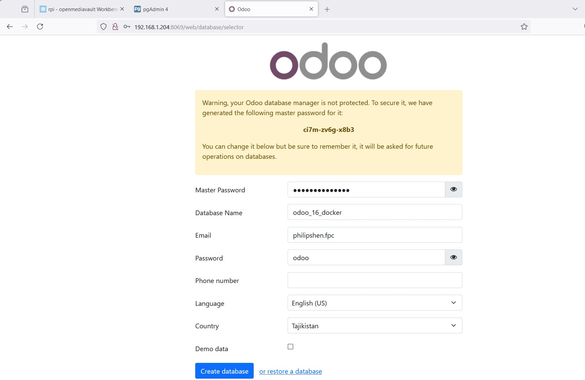
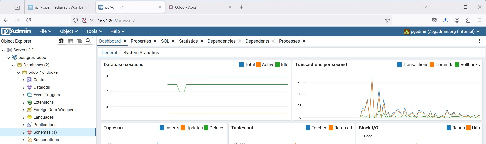

# Table of Contents
=================

   * [Purpose](#purpose)
   * [Installation on Linux(Ubuntu20.04 LTS)](#installation-on-linuxubuntu2004-lts)
      * [Reference](#reference)
   * [Installation on Raspberry Pi(desktop 32bit)](#installation-on-raspberry-pidesktop-32bit)
      * [Reference](#reference-1)
   * [Installation on Docker](#installation-on-docker)
      * [Reference](#reference-2)
      * [Troubleshooting](#troubleshooting)
   * [Installation on Mac(Ubuntu22.04LTS arm64)](#installation-on-macubuntu2204lts-arm64)
      * [Reference](#reference-3)
   * [Reference](#reference-4)

# Purpose  
Take a note of Odoo.

# Installation on Linux(Ubuntu20.04 LTS)  

## Reference 
[Yenthe666/InstallScript](https://github.com/Yenthe666/InstallScript?tab=readme-ov-file)  
[Yenthe666/auto_backup](https://github.com/Yenthe666/auto_backup) 
Automated database backups from Odoo, both locally and on an FTP server 

[Yenthe666/Odoo_Samples](https://github.com/Yenthe666/Odoo_Samples)  
This repository contains samples with Odoo code 

[hrmuwanika/odoo](https://github.com/hrmuwanika/odoo/tree/17.0) 
  ```
  Installation script for Odoo 17 on Ubuntu 22.04 
  ```

[Raspberry Pi安裝Odoo14紀錄 10月 14, 2021](https://www.eca.party/2021/10/raspberry-piodoo14.html)  


# Installation on Raspberry Pi(desktop 32bit)  

## Reference 
[Odoo Install Script for Raspberry Pi](https://github.com/oscars8a/OdooRaspberryPiInstallScript)
Odoo Install Script for Raspberry Pi and Ubuntu Server 20.04

[Raspberry Pi安裝Odoo14紀錄 10月 14, 2021](https://www.eca.party/2021/10/raspberry-piodoo14.html)  
[How to install Odoo POSBox on the Raspberry Pi?](https://stackoverflow.com/questions/48459719/how-to-install-odoo-posbox-on-the-raspberry-pi)  
[How to install Odoo on a Raspberry Pi OpenEMS](https://community.openems.io/t/how-to-install-odoo-on-a-raspberry-pi/2517)  


# Installation on Docker  
[docker-compose_odoo.yml](docker_compose/docker-compose_odoo.yml)   
[odoo.conf](config/odoo.conf)  

*http://192.168.1.204:8069*  
  

*http://192.168.1.202*  
  


## Reference 
[odoo-docker-tutorial-15](https://github.com/twtrubiks/odoo-docker-tutorial/tree/15.0)  
[Youtube Tutorial - Odoo](https://www.youtube.com/playlist?list=PLteWjpkbvj7pbdPXhIqgtX3v3pQxHz-5l)  

[docker-library/docs/oddd](https://github.com/docker-library/docs/tree/master/odoo)  

[利用 docker 快速建立 pgadmin4 以及 Ubuntu 本機如何安裝 pgadmin4](https://github.com/twtrubiks/docker-pgadmin4-tutorial)  
[Youtube Tutorial - 如何使用 pgadmin4 連接 odoo](https://youtu.be/afuB8wnozo8)    

[odoo-development-environment-tutorial](https://github.com/twtrubiks/odoo-development-environment-tutorial)  
[建立 odoo 開發環境 - Youtube Tutorial - 如何建立 odoo 開發環境 - odoo13 - 從無到有](https://youtu.be/Yazci5Rd0p4)  
[Odoo VSCode Debug - Youtube Tutorial - 如何在 VS Code 中 Debug - odoo13](https://youtu.be/cV8Sm5yYR38)  

[odoo/docker](https://github.com/odoo/docker)  
  ```
  This is the Git repo of the official Docker image for Odoo. See the Hub page for the full readme on how to use the Docker image and for information regarding contributing and issues.

  The full readme is generated over in docker-library/docs, specifically in docker-library/docs/odoo.
  ```

#### Troubleshooting    
[How to set an Odoo docker container using existing PostgreSQL server? Aug 20, 2022](https://stackoverflow.com/questions/73430003/how-to-set-an-odoo-docker-container-using-existing-postgresql-server)

[Multiples Odoo containers with multiples Postgresql containers Dec 12, 2019](https://stackoverflow.com/questions/59311431/multiples-odoo-containers-with-multiples-postgresql-containers)  

[Step-by-Step Guide for Installing Odoo with Docker Compose and Nginx Oct 8, 2023](https://sundar365.com.np/step-by-step-guide-for-installing-odoo-with-docker-compose-and-nginx)  

[Odoo development using Visual Studio Code and Docker  February 23, 2023](https://cetmix.com/blog/cetmix-blog-2/odoo-development-using-visual-studio-code-and-docker-1)  


# Installation on Mac(Ubuntu22.04LTS arm64)  

## Reference 
[Mac mini M2透過虛擬機安裝Odoo16紀錄 9月 20, 2023](https://www.eca.party/2023/09/mac-mini-m2odoo16.html)  


# Reference 
[[Day 27] 建立註冊的畫面及功能(十一) - Gmail設定(二)](https://ithelp.ithome.com.tw/articles/10254488)  
  ```
  Gamil smpt
  dpcviulzzvwipxjt\
  ```

[How to setup NGINX for Odoo? | Odoo NGINX configuration | Odoo Installation](https://youtu.be/-3wV7A_4s-w?feature=shared)  
[Upload records (contacts) in ODOO through excel using PYTHON | Odoo Development | XLSX Import Python](https://www.youtube.com/watch?v=SgFmOD9Q2S4)  
[Import/Upload Sale Order Lines from Excel sheet using PYTHON in ODOO | Odoo Development](https://www.youtube.com/watch?v=QZMD7EeyaUY)  
[How to Install Odoo 16 on Ubuntu 22.04](https://www.rosehosting.com/blog/how-to-install-odoo-16-on-ubuntu-22-04/)  
  ```
    Table of Contents

      Prerequisites
      Step 1. Update The System
      Step 2. Add System User
      Step 3. Install Dependencies
      Step 4. Install PostgreSQL
      Step 5. Install Wkhtmltopdf
      Step 6. Install Odoo
      Step 7. Create Odoo Systemd Unit file
      Step 8. Configure Reverse Proxy 
  ```

[Running Odoo in HTTPS using Nginx & Certbot  Feb 6, 2020](https://medium.com/@othmane.ghandi/running-odoo-in-https-using-nginx-certbot-90ef2f3e5ccb)  
[How to Configure SSL Certificate in NGINX  Feb 19, 2020](https://www.cybrosys.com/blog/how-to-configure-ssl-certificate-in-nginx)  
[To configure odoo with NGINX as a reverse proxy](https://www.cybrosys.com/blog/how-to-configure-odoo-with-nginx-as-reverse-proxy)  

[Quick and Easy Local SSL Certificates for Your Homelab!](https://www.youtube.com/watch?v=qlcVx-k-02E)  
[Odoo16 setup on ubuntu 20.04 or ubuntu 22.04 May 18, 2023](https://medium.com/@ajith.kalisetti99/odoo16-setup-on-ubuntu-20-04-or-ubuntu-22-04-60ef1803b4e4)  

[Odoo教學」1. Odoo安裝(Open ERP)，在Ubuntu/Linux虛擬機中建立 Odoo 環境 ! How to install Odoo on Ubuntu and Linux!](https://www.youtube.com/watch?v=94KyFyNPzh0)  
[Odoo教學」2. 如何新建 Odoo Database，No demo data。 Create odoo database in Odoo15!](https://www.youtube.com/watch?v=s-vMD-l9IE8&list=PLzoF0xJbyYF26ArFkzRoDHl01czdEGeHt&index=2)  

[在Ubuntu 20.04 LTS上安装部署Odoo15并设置Nginx SSL反向代理 2021年12月19日](https://huwencai.com/2021/12/%E5%9C%A8ubuntu-20-04-lts%E4%B8%8A%E5%AE%89%E8%A3%85%E9%83%A8%E7%BD%B2odoo15%E5%B9%B6%E8%AE%BE%E7%BD%AEnginx-ssl%E5%8F%8D%E5%90%91%E4%BB%A3%E7%90%86/)  
[如何以生产环境的标准在Ubuntu 20.04上安装部署Odoo14并设置Nginx和SSL 2021年1月4日](https://huwencai.com/2021/01/ubuntu-odoo14-nginx-ssl/)  

[GTLSCA TLS憑證，NGINX 伺服器設定方式 May 27, 2024](https://medium.com/@rz12345/gtlsca-tls%E6%86%91%E8%AD%89-nginx-%E4%BC%BA%E6%9C%8D%E5%99%A8%E8%A8%AD%E5%AE%9A%E6%96%B9%E5%BC%8F-5fb67d696dc0)  

[架設Nginx網頁伺服器與申請Let’s Encrypt的TLS/SSL憑證 2024/01/04](https://tzungshiun.com/nginx_with_certificates/)  

[第二部分：為網站加裝 SSL 憑證](https://man.twcc.ai/@twccdocs/howto-vcs-host-secure-multi-web-one-instance-main-zh/https%3A%2F%2Fman.twcc.ai%2F%40twccdocs%2Fhowto-vcs-host-secure-multi-web-one-instance-2-zh)  
[第三部分：驗證網域 & 安全連線](https://man.twcc.ai/@twccdocs/howto-vcs-host-secure-multi-web-one-instance-main-zh/https%3A%2F%2Fman.twcc.ai%2F%40twccdocs%2Fhowto-vcs-host-secure-multi-web-one-instance-3-zh)  
[(四)申請&設定SSL 靠Let’s encrypt簡單搞定](https://jax.blias.com/2019/01/21/wamp%E8%87%AA%E5%B7%B1%E7%9A%84%E7%B6%B2%E7%AB%99%E8%87%AA%E5%B7%B1%E6%9E%B6-%E7%AC%AC%E5%9B%9B%E7%AF%87/)  
[幫網站掛上 HTTPS，使用 Certbot 向 Let's Encrypt 申請憑證 最後更新於 2023-06-27](https://docfunc.com/posts/48/%E5%B9%AB%E7%B6%B2%E7%AB%99%E6%8E%9B%E4%B8%8A-https%E4%BD%BF%E7%94%A8-certbot-%E5%90%91-lets-encrypt-%E7%94%B3%E8%AB%8B%E6%86%91%E8%AD%89-post)  

How to Secure Nginx with Lets Encrypt on Ubuntu 20.04 with Certbot?
https://www.youtube.com/watch?v=R5d-hN9UtpU

如何使用Let's Encrypt在Ubuntu 20.04上保護Nginx
04/19/2021
https://blog.containerize.com/zh-hant/how-to-secure-nginx-with-letsencrypt-on-ubuntu-20-04/

DAY28 - 在主機上建立WordPress網站與SSL設定 
https://ithelp.ithome.com.tw/articles/10279792?sc=iThelpR

How to Secure Nginx with Lets Encrypt on Ubuntu 20.04 with Certbot?
https://www.youtube.com/watch?v=R5d-hN9UtpU


Easy Cloudflare SSL WordPress setup that the top 1% of websites use - Cloudflare SSL DNS
https://www.youtube.com/watch?v=d44H4G8cthE

 How to Setup @cloudflare FAST (DNS, Performance, Security) Updated 2024 - FREE PLAN! 
https://www.youtube.com/watch?v=CiOXICbaBQk

* []()
  


# h1 size

## h2 size

### h3 size

#### h4 size

##### h5 size

*strong*strong  
**strong**strong  

