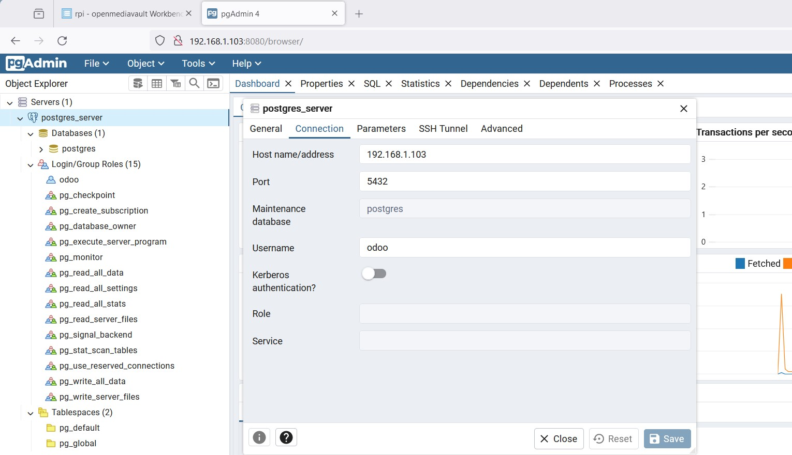

# Table of Contents
=================

   * [Purpose](#purpose)
   * [OpenMediaVault](#openmediavault)
      * [Installation](#installation)
         * [1. Raspberry Pi OS Lite(64bit) by Micro SD](#1-raspberry-pi-os-lite(64bit)-by-micro-sd)
         * [2. config.txt Setup](#2-configtxt-setup)
         * [3. WiFi and SSH Setup](#3-wifi-and-ssh-setup)
         * [4. OpenMediaVault Installation](#4-openmediavault-installation)
         * [5. OpenMediaVault Setup from Browser on Windows](#5-openmediavault-setup-from-browser-on-windows)
         * [6. SSH Setup](#6-ssh-setup)
         * [7. Format and Mount a USB drive](#7-format-and-mount-a-usb-drive)     
         * [8. Docker Configuration json](#8-docker-configuration-json)                           
         * [9. Docker images](#9-docker-images) 
            * [Global environmental variables](#global-environmental-variables)
            * [Portainer](#portainer)     
            * [Webdav](#webdav)
            * [PostgreSQL and PgAdmin4](#postgresql-and-pgadmin4)       
            * [Nextcloud](#nextcloud)       
            * [Reference](#reference)
            * [Troubleshooting](#troubleshooting)
      * [Reference](#reference-1)
   * [TrueNAS](#truenas)
      * [Reference](#reference-2)
   * [Reference](#reference-3)

# Purpose  
Take a note of NAS.


# OpenMediaVault   

## Installation  
### 1. Raspberry Pi OS Lite(64bit) by Micro SD  
  Raspberry Pi Imager installation on Windows 
    
    

### 2. config.txt Setup  
  ```
    #hdmi_safe=1
  ```

### 3. WiFi and SSH Setup  
  ```
    $touch boot/ssh
  ```

  ```
    $vi boot/wpa_supplicant.confg
    ctrl_interface=DIR=/var/run/wpa_supplicant GROUP=netdev
    update_config=1
    country=JP

    network={
      ssid="<アクセスポイントのSSID>"
      psk="<パスワード>"
    }
  ```

### 4. OpenMediaVault Installation  
  ```
    sudo -i
    sudo apt update
    sudo apt upgrade
  ```

  *OMV-Extras*
  (The following does not apply to SBC or i386- 32bit users. When using the scripted install, OMV-Extras is installed with openmediavault by default.)   
  ```
    cd /opt/
    wget -O - https://github.com/OpenMediaVault-Plugin-Developers/installScript/raw/master/install | sudo bash
  ```

### 5. OpenMediaVault Setup from Browser on Windows

### 6. SSH Setup  
  ```
  Whats missing? SSH as different user

  Does the user have SSH permissions? In the web-gui at "user management" - "users" - "edit" check if the group "ssh" is checked ("sudo" is also useful).  
  ```
  [Whats missing? SSH as different user](https://www.reddit.com/r/OpenMediaVault/comments/pv0ksz/whats_missing_ssh_as_different_user/) 

### 7. Format and Mount a USB drive    
  Find the virtual drive name:
  ```
  sudo fdisk -l
  ```

  Start fdisk:  
  ```
  sudo fdisk /dev/sda
  ```

  Use the following commands shortcuts in fdisk:
  ```  
    Create a new partition table: g (for GPT, use help for other formats)
    Create a new partition: n
    You can keep the default values for a single partition.
    Just press Enter after each question.
    Confirm with Y to remove the signature.
    And finally, write and exit fdisk: w
  ```

  Format the partition:
  ```
  sudo mkfs.ext4 /dev/sda1
  sudo mkfs.vfat /dev/sda1
  sudo mkfs.ntfs /dev/sda1
  ```

  Create a new folder in /media:
  ```
  sudo mkdir /media/usb1
  ```

  Mount the drive:
  ```
  sudo mount -t ext4 /dev/disk/by-uuid/xxxxx-xxxx /media/usb1/
  ```

  Automatically mount the USB drive:
  ```
  UUID=xxxxxx-xxxxx /media/usb1 ext4 defaults 0 0
  ```

### 8. Docker Configuration json  
  json修改内容
  /etc/docker/daemon.json
  ```
  {
    "log-driver": "json-file",
    "log-opts": {
      "max-size": "10m",
      "max-file": "3"
    },

    "ipv6": true,
    "fixed-cidr-v6":"fc01:17:1:1::/64",
    "registry-mirrors": [
    "https://dockerproxy.com",
    "https://https://docker.m.daocloud.io"
    ]

  }
  ```

  ```
  systemctl daemon-reload 

  systemctl restart docker.service 
  ```

### 9. Docker images    

#### Global environmental variables  
```
# THE FOLLOWING VARIABLES CAN BE USED IN ANY COMPOSE FILE
# THEIR VALUE WILL BE REPLACED BY THE VALUE ASSIGNED HERE
# YOU CAN ADD AS MANY VARIABLES AS YOU NEED
#
#
# Customize the PID and GID value of your appuser user.
# You can see it in the OMV GUI in the USERS > USERS tab
#
APPUSER_PUID=1002
APPUSER_PGID=100
#
# Customize your time zone value.
# You can see it in the OMV GUI in the SYSTEM > DATE & TIME tab
#
TIME_ZONE_VALUE=Europe/Madrid
#
# In this file you can define how many paths you need for different compose files.
# The following are examples corresponding to the example system in the Docker on OMV document on the omv-extras wiki.
#
PATH_TO_APPDATA=/srv/dev-disk-by-uuid-9d43cda9-20e5-474f-b38b-6b2b6c03211a/appdata
PATH_TO_DATA=/srv/mergerfs/pool/data
PATH_TO_DOCUMENTS=/srv/mergerfs/pool/data/documents
PATH_TO_MEDIA=/srv/mergerfs/pool/data/media
PATH_TO_MOVIES=/srv/mergerfs/pool/data/media/movies
PATH_TO_PHOTOS=/srv/mergerfs/pool/data/media/photos
PATH_TO_BACKUPS=/srv/dev-disk-by-uuid-384444bb-f020-4492-acd2-5997e908f49f/backups
PATH_TO_DOWNLOADS=/srv/dev-disk-by-uuid-384444bb-f020-4492-acd2-5997e908f49f/downloads
```

#### Portainer    

#### Webdav    

#### PostgreSQL and PgAdmin4    
```
curl -O https://raw.githubusercontent.com/khezen/compose-postgres/master/docker-compose.yml -o docker-compose_postgres_pgadmin4.yml
```
```
curl -O https://raw.githubusercontent.com/twtrubiks/odoo-docker-tutorial/vscode_debug_docker_odoo17/docker-compose.yml -o docker-compose_odoo.yml
```



#### Code Server     

#### Nextcloud   
*MACVLAN Setting*  
  


  


*Nextcloud Login Web*  
  


  

#### Reference  
[4. Global environmental variables](https://wiki.omv-extras.org/doku.php?id=omv7:docker_in_omv#global_environmental_variables)  

[openmediavault-Compose安装与设置 2024年03月21日](https://www.bilibili.com/read/cv33333171/)  
[omv 6.5 nas 系统教程 安装/docker/插件拓展 2023/11/04](https://hechuan.me/omv-6-5/)  
[OMV Docker-Compose PhotoPrism 2023-10-22 ](https://www.chungg.com/omv-docker-compose-photoprism/)  
[Getting Started with OpenMediaVault](https://wiki.friendlyelec.com/wiki/index.php/Getting_Started_with_OpenMediaVault#Docker_on_OMV)  

[New 2024 openmediavault getting started, omv extras and portainer  2024年1月29日](https://www.youtube.com/watch?v=2hU8e61UE9w)  
[*Link to my GitHub where you can find the portainer.yml file* ](https://github.com/robwithtech/homelab)  

[Installing Docker & Portainer with new OMV-Extras (June 2023) - Ad-Free](https://www.youtube.com/watch?v=olEAP0WcSdU)  
```
NSTALL PORTAINER
SSH into your OMV server and run:
docker run -d -p 8000:8000 -p 9443:9443 --name portainer --restart=always -v /var/run/docker.sock:/var/run/docker.sock -v portainer_data:/data portainer/portainer-ce:latest
```
[y0ngb1n/docker-registry-mirrors.md](https://gist.github.com/y0ngb1n/7e8f16af3242c7815e7ca2f0833d3ea6)  
[我在OMV上运行的一些有趣的Docker镜像  2021-04-21](https://east.moe/archives/1077)  
[loganmarchione/docker-webdav-nginx](https://hub.docker.com/r/loganmarchione/docker-webdav-nginx)  

[2 omv安装社区插件和改用国内源](https://www.youtube.com/watch?v=RQJmJYoWROo)   
[4 OMV设置snapraid插件](https://www.youtube.com/watch?v=b63S4oB8hrI)  
[5 omv系统设置联合文件系统](https://www.youtube.com/watch?v=dblNqi-VxSs)   
[6 omv安装docker](https://www.youtube.com/watch?v=Ge7lEE-Q5jo)   
```
df -h
```

2:00 select folder for docker
```
{
  "ipv6": true,
  "fixed-cidr-v6":"fc01:17:1:1::/64",
  "registry-mirrors": [
    "https://dockerproxy.com",
    "https://https://docker.m.daocloud.io"
  ]
}
```
[7 omv系统docker配置ddns和webdav](https://www.youtube.com/watch?v=FnUqJ0ZFxtI) 

[Docker-compose創建PostgreSQL Aug 25, 2021](https://cde566.medium.com/docker-compose%E5%89%B5%E5%BB%BApostgresql-7f3f9519fa20)

[khezen/compose-postgres](https://github.com/khezen/compose-postgres/tree/master)  
```
curl -O https://raw.githubusercontent.com/khezen/compose-postgres/master/docker-compose.yml -o docker-compose_postgres_pgadmin4.yml
```

[felipewom/docker-compose-postgres](https://github.com/felipewom/docker-compose-postgres/tree/main)  
```
curl -O https://raw.githubusercontent.com/felipewom/docker-compose-postgres/main/docker-compose.yml 
curl -O https://raw.githubusercontent.com/felipewom/docker-compose-postgres/main/init.sql
```

[Setting up a PostgreSQL Database on a Raspberry Pi   Oct 14, 2022](https://pimylifeup.com/raspberry-pi-postgresql/)  

[Nextcloud container on openmediavault using macvlan step-by-step Apr 15, 2024](https://www.youtube.com/watch?v=SQ80JmRQE_o)  
[homelab/docker compose/Nextcloud/nextcloud.yml](https://github.com/robwithtech/homelab/blob/main/docker%20compose/Nextcloud/nextcloud.yml)  
[home/other/ip subnet calculator](https://www.calculator.net/ip-subnet-calculator.html)  

[DockerコンテナにLAN内のIPアドレスを割り当て、ホストからもアクセス可能にする 2024-03-18](https://qiita.com/pochy9n/items/8c175db18da4a44ae2d2)
[Dockerの"分からない"を簡単にメモ  2023-08-03](https://qiita.com/fsd-fukufuku/items/f8539e562352c046f39c#%E7%8C%BF%E3%81%A7%E3%82%82%E3%81%A7%E3%81%8D%E3%82%8B%E3%82%B3%E3%83%B3%E3%83%86%E3%83%8A%E3%83%87%E3%83%BC%E3%82%BF%E3%83%99%E3%83%BC%E3%82%B9)  
[Linuxカーネルのコンテナ機能［5］ ─ネットワーク 2014-07-22](https://gihyo.jp/admin/serial/01/linux_containers/0006)  

[Macvlan network driver](https://docs.docker.com/network/drivers/macvlan/)  
[How to put docker containers on LAN network ? | Macvlan setup in GUI Jul 18, 2022](https://www.youtube.com/watch?v=6bbe1BdPycU)  
[Docker Networking Tutorial, ALL Network Types explained! Oct 26, 2021](https://www.youtube.com/watch?v=5grbXvV_DSk)  

[架設Nextcloud個人雲端硬碟 ＋ 網頁版LibreOffice教學 (docker-compose + ZeroTier內網穿透) May 18, 2023](https://ivonblog.com/posts/nextcloud-docker/)  
[Docker安裝私有雲端硬碟Nextcloud 27.0.2-含線上office服務 Sep 5, 2023](https://blog.tomy168.com/2023/09/dockernextcloud-2702-office.html)  
[NextCloud安装和使用图文教程 2021-11-05](https://cloud.tencent.com/developer/article/1897454)  

#### Troubleshooting    
*[Errno 13] Permission denied: '/var/lib/pgadmin/sessions'*  
[HELP with pgAdmin volume mount.](https://www.reddit.com/r/docker/comments/11xr3gc/help_with_pgadmin_volume_mount/)  
adding user on the service works
```
user: "${UID}:${GID}"
```

[Permission denied: '/var/lib/pgadmin/sessions' in Docker](https://stackoverflow.com/questions/64781245/permission-denied-var-lib-pgadmin-sessions-in-docker)  

[VS Code: NoPermissions (FileSystemError): Error: EACCES: permission denied Mar 5, 2021](https://stackoverflow.com/questions/66496890/vs-code-nopermissions-filesystemerror-error-eacces-permission-denied)  

```
sudo chown -R username path 
```
```
sudo chown -R appuser /srv/dev-disk-by-uuid-417ee010-3948-4114-8776-bc1fdf6b5599/data/docker_appdata/code-server/project
```


## Reference  
[Raspberry Pi 4 + OpenMediaVaultでNASを構築する 2023/03/13](https://zenn.dev/oversleep/articles/3f9ad984a37aba)  
[Raspberry Pi 4が起動しない（モニタが映らない）場合の設定方法 2022-07-06](https://qiita.com/karaage0703/items/97808dfb957b3312b649)  

[RaspberryPI4をサーバーにして遊び倒す。その１ 2020-12-24](https://qiita.com/miyukiaizawa/items/99da331359eaf4c7eec7)
```
DockerとPortainerのインストール
```
[RaspberryPI4をサーバーにして遊び倒す。その２ 2020-12-20](https://qiita.com/miyukiaizawa/items/37d4d386150eddaaeddb)  

[RaspberrypiでNASを作成する 2024-03-12](https://qiita.com/T3pp31/items/36a9ce18b0780ff04cd3)  

[PythonでRaspberryPiで撮影したカメラ映像をリアルタイム転送する 2023-01-27](https://qiita.com/Yurix/items/e3260da3d91451c5a60a)  

[Raspberry PiでRAID付きNASを構築する 2023-09-02](https://qiita.com/YaezakuraP/items/d0c41d6c5ee8438fecbb)

[Raspberry Piでprimary/2replica構成のMySQL serverを建てる 2024/05/1](https://zenn.dev/kumashun8/articles/ab8ef900613f7c)  

[OMV7.xをbookworm(Pi 4)へ新規インストールする方法 2024-03-09](https://raspida.com/omv7-bookworm-pi4)  
[初心者でもラズパイでNASサーバーを作ってみよう！ 2024-03-13](https://raspida.com/make-nas-rpi)  
[openmediavaultでexfatの外付けハードディスクを利用する 2023-05-03](https://raspida.com/omv-exfat/)  

[Raspberry pi 4 でNAS（openmediavault）を構築する方法 2020-10-20](https://qiita.com/zono_0/items/1eb877ad9c6e5ac12532#14-guiopenmediavault%E3%81%B8%E3%82%A2%E3%82%AF%E3%82%BB%E3%82%B9)  

[【Raspberry Pi4】新OS「Bullseye」で自宅用NASを構築する-前編 OpennMediaVault6対応 2022.06.05](https://immedeep.com/raspberrypi4-omv-nas-1/364/)  
[【Raspberry Pi4】新OS「Bullseye」で自宅用NASを構築する-後編 OpennMediaVault6の導入とベンチマーク 2022.10.19](https://immedeep.com/raspberrypi4-omv-nas-2/454/)  

[【低成本 Raspberry Pi 家用伺服器】前置動作: 在 Raspberry pi 4 上安裝 Ubuntu Server 08292020](https://journal.travelhackfun.com/raspberry-pi-4-ubuntu/)  
[【低成本 Raspberry Pi 家用伺服器】之二 – Raspberry Pi NAS | 使用USB外接硬碟設定 RAID 1 09262023](https://journal.travelhackfun.com/raspberry-pi-nas/)  
[【低成本家用伺服器】之三 – 10分鐘在Raspberry Pi上架多個WordPress網站 10232023](https://journal.travelhackfun.com/multi-wordpress-raspberrypi/)  

[自己动手使用树莓派搭建家用NAS和流媒体服务器 2023-11-13](https://www.packetmania.net/2021/12/19/RPi-NAS-Plex/)  

[Installing OpenMediaVault to a Raspberry Pi Jun 11, 2022](https://pimylifeup.com/raspberry-pi-openmediavault/)  

[(Docker) Compose Plugin For OMV7](https://wiki.omv-extras.org/doku.php?id=omv7:omv7_plugins:docker_compose)  
[Docker in OMV 7](https://wiki.omv-extras.org/doku.php?id=omv7:docker_in_omv)  

[Mounting USB Drives Under Debian Aug 14, 2023](https://www.naturalborncoder.com/backup/2023/08/14/mounting-usb-drives-under-debian/)  
[How To Mount a USB Drive On The Raspberry Pi (3 ways)](https://raspberrytips.com/mount-usb-drive-raspberry-pi/)    
[How to Format and Mount a USB drive on Raspberry Pi](https://raspberrytips.com/format-mount-usb-drive/)  

[OMV7 Docker安装(openmediavault7 install docker)](https://www.youtube.com/watch?v=O_G4A1Gllqo)  

[How to build a NAS server from old hard drives](https://www.youtube.com/watch?v=6LqFY5yymKQ&t=0s)  

[16 Steps to install the new compose plugin and add portainer](https://forum.openmediavault.org/index.php?thread/48797-16-steps-to-install-the-new-compose-plugin-and-add-portainer/)  

[How to Install Docker on OpenMediaVault Dec 1, 2022](https://www.wundertech.net/how-to-install-docker-on-openmediavault/)  


# TrueNAS   

## Reference  

# Reference
[大画面テレビの録画用HDDの代わりにRasberry Pi4のUSB OTG機能を生かしてUSBtoLAN(NAS)なストレージゲートウェイを構成する 2020-03-13](https://qiita.com/kthrtty/items/7243d59bb418de50f732)  


* []()
  


# h1 size

## h2 size

### h3 size

#### h4 size

##### h5 size

*strong*strong  
**strong**strong  

