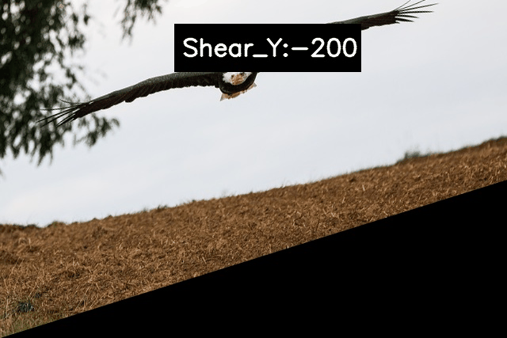
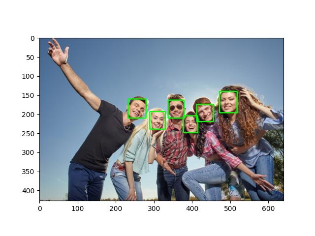

# Table of Contents
=================

   * [Table of Contents](#table-of-contents)
   * [Purpose](#purpose)
   * [Image Processing Tutorials](#image-processing-tutorials)
      * [Sampling and Quantization](#sampling-and-quantization)
      * [Scaling and Rotation](#scaling-and-rotation)
      * [Image Enhancement](#image-enhancement)
         * [Image Negative](#image-negative)
         * [Gamma Correct](#gamma-correct)
         * [Beta Correct](#beta-correct)
         * [Histogram Equalize](#histogram-equalize)
            * [Reference](#reference)
         * [Average Filtering](#average-filtering)
         * [Gaussian Filtering](#gaussian-filtering)
      * [Image Gradiant and Image Sharpening](#image-gradiant-and-image-sharpening)
         * [Sobel Filtering and Scharr Filtering](#sobel-filtering-and-scharr-filtering)
         * [Laplacian and Composite Laplacian](#laplacian-and-composite-laplacian)
         * [Unsharp Masking, Median Filter, and Bilateral Filtering](#unsharp-masking-median-filter-and-bilateral-filtering)
      * [Noise, PSNR](#noise-psnr)
      * [Image Inpainting](#image-inpainting)
            * [Reference](#reference-1)
      * [Affine Transformation and Pseudocolor Transform](#affine-transformation-and-pseudocolor-transform)
         * [Shift_X](#shift_x)
         * [Shift_y](#shift_y)
         * [Random_Shift](#random_shift)
         * [Scale](#scale)
         * [Horizontal Shear](#horizontal-shear)
         * [Vertical Shear from Upper Right](#vertical-shear-from-upper-right)
         * [Vertical Shear from Upper Left](#vertical-shear-from-upper-left)
         * [Horizontal Flip](#horizontal-flip)
         * [Vertical Flip](#vertical-flip)
         * [Rotate at Upper Left](#rotate-at-upper-left)
         * [Rotate at Central Point](#rotate-at-central-point)
         * [Rotate Fit](#rotate-fit)
         * [Image Mosaicing](#image-mosaicing)
            * [Reference](#reference-2)
      * [Edge Detection, Morphology Transform](#edge-detection-morphology-transform)
         * [Sobel laplacian_Filter](#sobel-laplacian_filter)
         * [Canny](#canny)
         * [Morghology](#morghology)
         * [Rinkaku](#rinkaku)
         * [Reference](#reference-3)
      * [Image Thresholding, Adaptive Thresholding, Watershed, and GrabCut](#image-thresholding-adaptive-thresholding-watershed-and-grabcut)
      * [Line Detection and Circle Detection](#line-detection-and-circle-detection)
         * [findcontours: RetrievalModes](#findcontours-retrievalmodes)
            * [Black Contours](#black-contours)
            * [White Contours](#white-contours)
            * [RETR_EXTERNAL](#retr_external)
            * [RETR_LIST](#retr_list)
            * [RETR_CCOMP](#retr_ccomp)
            * [RETR_TREE](#retr_tree)
         * [Reference](#reference-4)
      * [Region, Pattern recongnition](#region-pattern-recongnition)
         * [WaterShed](#watershed)
         * [Edge Info](#edge-info)
         * [Circel Detection](#circel-detection)
         * [Static Saliency](#static-saliency)
         * [Face Detection](#face-detection)
         * [Human Detection](#human-detection)
         * [K-means](#k-means)
         * [BOVW: Bag Of Visual Words](#bovw-bag-of-visual-words)
      * [Flourier Transformation](#flourier-transformation)
      * [Moment](#moment)
   * [OpenCV-Python Tutorials](#opencv-python-tutorials)
      * [dlib](#dlib)
      * [A: cv2.CascadeClassifier](#a-cv2cascadeclassifier)
      * [B: cv2.dnn_DetectionModel](#b-cv2dnn_detectionmodel)
      * [C: cv2.FaceDetectorYN](#c-cv2facedetectoryn)
      * [D: cv2.FaceRecognizerSF](#d-cv2facerecognizersf)
      * [Reference](#reference-5)
   * [OpenCV on Ubuntu in C++](#opencv-on-ubuntu-in-c)
     * [OpenCV Installtion with CUDA](#opencv-installtion-with-cuda)
     * [OpenCV Installtion without CUDA](#opencv-installtion-without-cuda)
     * [Header files and Library files](#header-files-and-library-files)
     * [RGB and Gray Scale](#rgb-and-gray-scale)
     * [Reference](#reference-6)   
   * [Troubleshooting](#troubleshooting)
      * [install libgtk2.0-dev and pkg-config, then re-run cmake or](#install-libgtk20-dev-and-pkg-config-then-re-run-cmake-or)
      * [ModuleNotFoundError: No module named '_lzma'](#modulenotfounderror-no-module-named-_lzma)
      * [How to install tkinter for python 3.7 on xubuntu 20.04?](#how-to-install-tkinter-for-python-37-on-xubuntu-2004)
      * [Can't use SURF, SIFT in OpenCV](#cant-use-surf-sift-in-opencv)
      * [BRIEF (Binary Robust Independent Elementary Features)](#brief-binary-robust-independent-elementary-features)
   * [Reference](#reference-7)
   * [h1 size](#h1-size)
      * [h2 size](#h2-size)
         * [h3 size](#h3-size)
            * [h4 size](#h4-size)
               * [h5 size](#h5-size)

Created by [gh-md-toc](https://github.com/ekalinin/github-markdown-toc)

# Purpose  
Take note of OpenCV  


# Image Processing Tutorials 
[數位影像處理 系列](https://ithelp.ithome.com.tw/users/20152370/ironman/5641)  
[Damien-Chen/Image_Processing](https://github.com/Damien-Chen/Image_Processing)    

## Sampling and Quantization
[21_image_quantization_threshold.py](21_image_quantization_threshold.py)  


## Scaling and Rotation  
[22_image_scaling_rotation.py](22_image_scaling_rotation.py)  

## Image Enhancement  
```
影像增強技術所採用的方法包含以下幾種:

    強度轉換(Intensity Transformation)
    直方圖處理(Histogram Processing)
    影像率波(Image Filtering)

也可以根據數位影像處理所在的域(Domain)分為:

    空間域(Spatial Domain)
    頻率域(Frequency Domain)
```

### Image Negative  

### Gamma Correct  
[23_image_negative_gamma_correct.py](23_image_negative_gamma_correct.py)  

### Beta Correct  

### Histogram Equalize  

```
cv2.calcHist(images, channels, mask, histSize, ranges[, hist[, accumulate]])

images : 
入力画像です．画素値のデータ型はuint8かfloat32のどちらかです．記号[]を使って “[img]” のように指定します。

channels : 
ヒストグラムを計算する画像のチャンネルのインデックスです．入力画像がグレースける画像であれば[0]を指定します．
カラー画像であればヒストグラムを計算するB,G,Rの色相に対応する[0]，[1]，[2]のどれかの値を指定します。

mask : 
マスク画像です．画像中の全画素のヒストグラムを計算する場合 “None” を指定します．
画像中の特定領域のヒストグラムを計算する場合は特定領域を表すマスク画像を指定します(以下に例を示します)。

histSize : 
ビンの数です．この引数も記号[]を使って指定します．全画素値を対象とするのであれば [256] を指定します。

ranges : 
ヒストグラムを計測したい画素値の範囲を表す RANGE です．通常は [0,256] を指定します。
```

  

```
當強度分布集中在高強度範圍，可以判斷為過曝，若集中在低強度範圍，可以判斷為曝光不足。
若強度分布僅集中在部分強度範圍，則可判斷為低對比度(Low Contrast)影像
```
[24_beta_correct_histogram_equalize.py](24_beta_correct_histogram_equalize.py)  

#### Reference  
[[OpenCV】透過画像も使えるヒストグラム生成関数を作ってみた！](https://zenn.dev/s_2010_119/articles/02a40e9f9f5cab)  

  

[OpenCVでRGBとHSVのヒストグラムを取得する方法 Last updated at 2020-01-20](https://qiita.com/tatsuya11bbs/items/ff4a07d73e14385b6922)  

### Average Filtering  
  

### Gaussian Filtering 
  

[25_average_filtering_gaussian_filtering.py](25_average_filtering_gaussian_filtering.py)

## Image Gradiant and Image Sharpening  

### Sobel Filtering and Scharr Filtering  

### Laplacian and Composite Laplacian
  

[26_gradiant_laplace_Composite_laplace.py](26_gradiant_laplace_Composite_laplace.py)

### Unsharp Masking, Median Filter, and Bilateral Filtering  
[27_unsharp_masking_median_bilateral_filter.py](#27_unsharp_masking_median_bilateral_filter.py)  

## Noise, PSNR  
[28_PSNR_noise_analysis.py](#28_PSNR_noise_analysis.py)  
  

## Image Inpainting  

#### Reference  
[PythonとOpenCVで消しゴムマジックやってみた！ Posted at 2023-06-05](https://qiita.com/dancingedamame/items/3a3f689af8b94073c2f8)  
[pixabay](https://pixabay.com/ja/)  

[画像の一部を消すInpainting という技術とその実装 (python)](https://lp-tech.net/articles/kb4bO)  
[OpenCVで画像のInpaintingの解説](https://data-analysis-stats.jp/%e6%a9%9f%e6%a2%b0%e5%ad%a6%e7%bf%92/opencv%e3%81%a7%e7%94%bb%e5%83%8f%e3%81%aeinpainting%e3%81%ae%e8%a7%a3%e8%aa%ac/)  

[29_Inpainting.py](#29_Inpainting.py)

## Affine Transformation and Pseudocolor Transform  
[30_1_color_to_gray_pseudocolor.py](#30_1_color_to_gray_pseudocolor.py)  

[30_2_geometric_transformations.py](#30_2_geometric_transformations.py)  

*Linear*  
  
*Rotation*  
  
*Flip*  
  
*Skew*  
  
*Parllel_Shift*  
  
*Affine_Transform*  
  
*Euclidean_Transform*  
```
アフィン変換の特殊な例で、任意の回転と平行移動を組みわせたもの
```
  

*Similar_Transform*  
```
ユークリッド変換に対し、縦横の倍率が等しい拡大・縮小を加えたもの
```
  

*Projective_Transform*  
  
  

[完全に理解するアフィン変換 Last updated at 2019-02-13](https://qiita.com/koshian2/items/c133e2e10c261b8646bf)  
[30_3_affine_transform.py](#30_3_affine_transform.py)

### Shift_X  
   

```
Parllel Shift
```

  

### Shift_y  
   

```
Vertical Shift
```

  

### Random_Shift  
   

```
Random Shift
```

  

### Scale  
   

```
Expand, Shrink  
```
  


### Horizontal Shear  
   

```
Horizontal Shear
```
  


### Vertical Shear from Upper Right 
   

```
Vertical Shear from Upper Right
```
  

### Vertical Shear from Upper Left   
   

```
Vertical Shear from Upper Left
```
  

### Horizontal Flip
   

```
Horizontal Flip
```
  


### Vertical Flip
   

```
Vertical Flip
```
  


### Rotate at Upper Left   

   

```
Rotate at Upper Left
```
  

### Rotate at Central Point     
   

```
Rotate at Central Point
```
  

### Rotate Fit     
[30_4_img_rotation.py](30_4_img_rotation.py)  

```
Rotate at Central Point
```
  

```
Rotate at Central Point with Region
```
  

### Image Mosaicing 
```
複数の画像をつなぎ合わせて1つの画像とすることを、イメージモザイキングと呼ぶ。
概略の処理手順は、以下のようになる。

  1. 特徴点と検出のマッチング
  2. 幾何学的変換の推定
  3. 画像の幾何学的変換と合成
```

```
RANSAC(RAndom SAmple Conensus)と呼ばれる方法がよく利用される。
RNSACによるパラメータの推定の手順を、以下に述べる。

  1. パラメータを推定するために必要最小限のデータをランダムに選択する。上の場合、4組の対応点を選択する。
  2. 選択した4組の対応点座標を用いて、射影変換のパラメータを求める。
  3. 求めた射影変換パラメータを用いて、他の全ての対応点が正しく変換されているかチェックする。
      ここで、正しく変換された対応点はインライヤと呼ばれる。用いたパラメータに対するインライヤの数を記憶する。
  4. 1~3の処理を繰り返し、最後に最もインライヤの数が多い射影変換パラメータとそのインライヤを結果として出力する。
```

  

  

#### Reference  
[python+opencvで画像処理の勉強5 幾何学的変換 Last updated at 2022-01-13](https://qiita.com/tanaka_benkyo/items/5840a36d0e97a8498388)  
[指定した角度づつ元画像の中心を軸に回転させた画像を作成して保存する。Last updated at 2018-09-08](https://qiita.com/goodboy_max/items/2fdcf8aba457adceafd4)  


## Edge Detection, Morphology Transform  
[31_edge_morphology.py](31_edge_morphology.py)  

### Sobel laplacian_Filter
  

### Canny  
  
[OpenCV – Canny 法で画像からエッジを検出する方法 2020.08.29](https://pystyle.info/opencv-canny/)  
```
edges = cv2.Canny(image, threshold1, threshold2[, edges[, apertureSize[, L2gradient]]])
```  

### Morghology  
  

### Rinkaku  
  

### Reference  
[pythonで一から画像処理 (3)エッジ検出、モルフォロジー変換 Posted at 2019-10-19](https://qiita.com/fugunoko/items/8997e3d160d8ed93eaa9)  


## Image Thresholding, Adaptive Thresholding, Watershed, and GrabCut 
[32_image_threshold.py](32_image_threshold.py)   

**Threshold**  
  
  

**Adaptive Threshold**  
  

**OOtu**  
  


## Line Detection and Circle Detection  
[RyuSeiri/ContourDetectionAndApproximation](https://github.com/RyuSeiri/ContourDetectionAndApproximation/tree/master)  

```
処理の流れ

1. 元画像の読み込み
2.  HSV色空間に変換
3.  H、S、Vそれぞれの要素のみの画像を取得
4.  上記の使えそうな画像のヒストグラムを平坦化
5.  二値化
6.  モーフィング(Morphing)処理（今回はクロージング(clothing)）
7.  輪郭検出
8.  輪郭近似
9.  輪郭描画
```

[OpenCV – findContours で画像から輪郭を抽出する方法 2020.08.13](https://pystyle.info/opencv-find-contours/#outline__6)
```
contours, hierarchy = cv2.findContours(image, mode, method[, contours[, hierarchy[, offset]]])
```  
```
引数
   image: 入力画像 (8bit、1チャンネル)。非0の画素は1とした2値画像として扱われる。
   mode: 輪郭を検索する方法を指定する。
   method: 輪郭を近似する方法を指定する。
   offset: 返り値の輪郭の点にオフセットを加算したい場合は指定する。
返り値
   contours: 抽出された輪郭のリスト。各輪郭は (NumPoints, 1, 2) の numpy 配列。
   hierarchy: 階層構造のリスト。(1, NumContours, 4) の numpy 配列。
```
  

### findcontours: RetrievalModes  

#### Black Contours  
```
ブロブの最外行列の頂点を反時計回りに抽出するようです。
```
  

#### White Contours  
```
ブロブの最外行列の外側を下図のように時計回りに抽出するようです。
```
  

#### RETR_EXTERNAL  
```
輪郭のうち、最も外側の輪郭のみを抽出するモードです。輪郭の内側に輪郭があっても、抽出しません。従って、白ブロブの輪郭は検出しません。
```  
  

#### RETR_LIST  
```
白の輪郭、黒の輪郭、内側、外側関係なく、同じ階層で輪郭が取得されます。ですので輪郭の取得する順番は、「・気づいたこと」で説明した順番になります。
``` 
  

#### RETR_CCOMP  
```
まず黒ブロブの輪郭を全て抽出した後に白ブロブの輪郭を抽出します。順番は、「・気づいたこと」で説明した順番になります。
```  
  

#### RETR_TREE  
```
入れ子構造になった輪郭を完全に表現します。つまり、まず黒ブロブを「・気づいたこと」で説明した順番に検出していき、
入れ子構造になっているブロブを見つけるとそのブロブ内のブロブの輪郭を抽出していきます。
```  
  

[OpenCV (findContours) Detailed Guide Jun 22, 2020](https://medium.com/analytics-vidhya/opencv-findcontours-detailed-guide-692ee19eeb18)  


[33_rinkaku.py](33_rinkaku.py)  

  

### Reference  
[pythonで一から画像処理 (4)輪郭抽出 Posted at 2019-11-23](https://qiita.com/fugunoko/items/7e5056449e172cbeadd9)  

[[OpenCV][Python3]検出した輪郭を描画し、輪郭線を近似して滑らかにする Last updated at 2019-07-05](https://qiita.com/y_kani/items/c9861b1f3517c32491d6#%E3%81%AF%E3%81%98%E3%82%81%E3%81%AB)  
[【OpenCV; Python】findcontours関数のまとめ Last updated at 2017-11-26](https://qiita.com/anyamaru/items/fd3d894966a98098376c)  

## Region, Pattern recongnition  
[python+opencvで画像処理の勉強7 領域処理](https://qiita.com/tanaka_benkyo/items/0a607c01fcbe8e0a934f)  
[34_1_region_texture.py](34_1_region_texture.py)  
```  
Mean-shiftは画像サイズが大きいと時間がかかります。

画素値のプロットとクラスタリングの結果を確認します。
k-meansに比べてMean-shiftの方がバランスよく分けられていることが分かります。
```  

  
  
  

### WaterShed  
  


[python+opencvで画像処理の勉強8 パターン・図形・特徴の検出とマッチング](https://qiita.com/tanaka_benkyo/items/f65ffabc32538020ba20)    
[34_2_pattern_unique.py](34_2_pattern_unique.py)  

  

### Edge Info    
  

### Circel Detection   
  
  

### Static Saliency   
  


[python+opencvで画像処理の勉強9 パターン認識](https://qiita.com/tanaka_benkyo/items/43ef63f54f3dc191e64b)  
[34_3_pattern_recongnition.py](34_3_pattern_recongnition.py)  

### Face Detection     
  

### Human Detection     
  

[Clustering method Mean Shift Feb 24, 2019](https://medium.com/ai-academy-taiwan/clustering-method-2-cd9bb883a0cb)  

### K-means  
[OpenCV – k 平均法で画像の代表色を取得する方法 2020.08.21](https://pystyle.info/opencv-kmeans/)  
OpenCV で k 平均法 (k-means) を使って、画像の代表色を取得する方法を紹介します。


### BOVW: Bag Of Visual Words  

[OpenCV 3で犬と猫を分類できるように学習してみる（BOW: Bag Of Visual Words, KNN: k-Nearest Neighbour, k-meansクラスタリング, KAZE）Last updated at 2016-09-22](https://qiita.com/hitomatagi/items/883770046de5746a5deb)
```
物体認識は、訓練フェーズとテストフェーズに分かれ、それぞれ、次のようになります。

    訓練フェーズ
        入力画像
        特徴量抽出
        特徴量をクラスタリング
        クラスタリングされた特徴量を集計（ヒストグラム）
        ヒストグラムと物体カテゴリの相関を学習

    テストフェーズ
        入力画像
        特徴量抽出
        特徴量をクラスタリング
        クラスタリングされた特徴量を集計（ヒストグラム）
        ヒストグラムがどの物体カテゴリに近いか距離を計算
```

```
今回、それぞれのステップでOpenCV3でサポートされている以下の手法を用いました。

    ステップ２
    　KAZE
    ステップ３～５
    　BOW: Bag Of Visual Words
    　・訓練フェーズ：k-meansクラスタリング
    　・テストフェーズ：KNN: k-Nearest Neighbour
```

```
「Bag Of Visual Words」は、画像の特徴量を１次元のベクトルに次元圧縮する手法です。
Bag of Wordsとか、Bag of Featuresとか、いろいろな名前で呼ばれています。
k-meansでk個のカテゴリに分類し、各カテゴリ毎にそのカテゴリに入る特徴量の個数を集計してヒストグラムを作成します。
テストフェーズでは、KNNを使ってどのクラスに分類されるのかを判定します。
```
  

[出典：イリノイ大学](http://www.ifp.illinois.edu/~yuhuang/sceneclassification.html)

## Flourier Transformation  
[pythonで一から画像処理 (5)フーリエ変換 Posted at 2020-05-16](https://qiita.com/fugunoko/items/41c33ca163c7bb52d283)
[35_1_fourier.py](35_1_fourier.py)  

[python+opencvで画像処理の勉強4 周波数領域におけるフィルタリング Last updated at 2022-01-12](https://qiita.com/tanaka_benkyo/items/bfa35e7f08faa7b7a985)
[35_2_fourier.py](35_2_fourier.py)  

## Moment 
[OpenCV – 画像モーメントについて解説 2023.06.24](https://pystyle.info/opencv-image-moment/)


# OpenCV-Python Tutorials 


## dlib  
[shape_predictor_68_face_landmarks.dat.bz2](http://dlib.net/files/shape_predictor_68_face_landmarks.dat.bz2)  
[04_face_landmark_sample.py](04_face_landmark_sample.py)  
[05_face_landmark_sample2.py](05_face_landmark_sample2.py)  

## A: cv2.CascadeClassifier  

## B: cv2.dnn_DetectionModel   

## C: cv2.FaceDetectorYN   

   

## D: cv2.FaceRecognizerSF  

   

## Reference  
[OpenCV-Python Tutorials ](https://docs.opencv.org/4.6.0/d6/d00/tutorial_py_root.html)

[(第2回)Python + OpenCV で遊んでみる(基本画像処理編)](https://itport.cloud/?p=6624)  
[01_test_opencv.py](01_test_opencv.py)  

[(第3回)Python + OpenCV で遊んでみる(顔検出編)](https://itport.cloud/?p=6940)  

[pythonとdlibでお手軽に顔のランドマークを検出してみた posted at 2019-12-03](https://qiita.com/mimitaro/items/bbc58051104eafc1eb38#%E3%81%8A%E6%89%8B%E8%BB%BD%E3%81%AB%E9%A1%94%E3%81%AE%E3%83%A9%E3%83%B3%E3%83%89%E3%83%9E%E3%83%BC%E3%82%AF%E6%A4%9C%E5%87%BA%E3%82%92%E3%82%84%E3%81%A3%E3%81%A6%E3%81%BF%E3%81%9F)  

[PythonでOpenCVの顔認識を試してみた updated at 2019-09-12](https://qiita.com/s-kajioka/items/b9207812fc968161f78b)  

[OpenCVの新しい顔検出を試してみる updated at 2023-06-27](https://qiita.com/UnaNancyOwen/items/f3db189760037ec680f3)  
[OpenCV ObjDetect Module Face Detection (YuNet/libfacedetection) Sample](https://gist.github.com/UnaNancyOwen/3f06d4a0d04f3a75cc62563aafbac332#file-face_detector-py)  
[06_face_detector.py](06_face_detector.py)   

[OpenCVで顔検出する posted at 2022-06-27](https://qiita.com/studio_haneya/items/97560b54b8348db8de87)  

[(第4回)Python + OpenCV で遊んでみる(リアルタイム顔検知編)](https://itport.cloud/?p=6983)  
[07_real_time_detector.py](07_real_time_detector.py)  

[(第5回)Python + OpenCV で遊んでみる(YOLOを用いた物体検出編)](https://itport.cloud/?p=7652)  
[]()

[(最終回)Python + OpenCVで遊んでみる(OCR編)](https://itport.cloud/?p=8326)  


# OpenCV on Ubuntu in C++  

## OpenCV Installtion with CUDA      
Check version  
```
# nvidia-smi
Fri Sep 29 15:58:24 2023       

| NVIDIA-SMI 520.61.05    Driver Version: 520.61.05    CUDA Version: 11.8     |
|-------------------------------+----------------------+----------------------+
| GPU  Name        Persistence-M| Bus-Id        Disp.A | Volatile Uncorr. ECC |
| Fan  Temp  Perf  Pwr:Usage/Cap|         Memory-Usage | GPU-Util  Compute M. |
|                               |                      |               MIG M. |
|===============================+======================+======================|
|   0  NVIDIA GeForce ...  On   | 00000000:01:00.0 Off |                  N/A |
| 53%   50C    P0    50W / 170W |     10MiB / 12288MiB |      0%      Default |
|                               |                      |                  N/A |
+-------------------------------+----------------------+----------------------+
                                                                               
+-----------------------------------------------------------------------------+
| Processes:                                                                  |
|  GPU   GI   CI        PID   Type   Process name                  GPU Memory |
|        ID   ID                                                   Usage      |
|=============================================================================|
|    0   N/A  N/A      1348      G   /usr/lib/xorg/Xorg                  4MiB |
|    0   N/A  N/A      2103      G   /usr/lib/xorg/Xorg                  4MiB |
+-----------------------------------------------------------------------------+
```

```
# nvcc -V
nvcc: NVIDIA (R) Cuda compiler driver
Copyright (c) 2005-2019 NVIDIA Corporation
Built on Sun_Jul_28_19:07:16_PDT_2019
Cuda compilation tools, release 10.1, V10.1.243
```

Build with opencv_contrib 
```
# Install minimal prerequisites (Ubuntu 18.04 as reference)
sudo apt update && sudo apt install -y cmake g++ wget unzip

# Download and unpack sources
wget -O 4.5.5.tar.gz https://github.com/opencv/opencv/archive/4.5.5.tar.gz
tar -zxvf 4.5.5.tar.gz 
wget -O 4.5.5.tar.gz https://github.com/opencv/opencv_contrib/archive/4.5.5.tar.gz
tar -zxvf 4.5.5.tar.gz 

# Create build directory and switch into it
mkdir -p build && cd build

$ ls -l ../
 ./
　├ build/
　├ opencv-4.5.5/
　├ opencv_contrib-4.5.5/

# Configure
cmake -DOPENCV_EXTRA_MODULES_PATH=../opencv_contrib-4.5.5/modules ../opencv-4.5.5
```

```
CC=gcc-9 CXX=g++-9 cmake -D CMAKE_BUILD_TYPE=RELEASE \
 -D CMAKE_CXX_FLAGS="-std=c++17" \
 -D CMAKE_INSTALL_PREFIX=/usr/local/lib/opencv4.5 \
 -D OPENCV_EXTRA_MODULES_PATH=../opencv_contrib-4.5.5/modules \
 -D INSTALL_C_EXAMPLES=ON \
 -D INSTALL_TESTS=ON \
 -D WITH_MKL=OFF \
 -D WITH_CUDA=ON \
 -D CUDA_FAST_MATH=ON \
 -D WITH_CUDNN=ON \
 -D ENABLE_FAST_MATH=ON \
 -D CUDA_ARCH_BIN=7.5 \
 -D CUDA_ARCH_PTX=7.5 \
 -D BUILD_EXAMPLES=ON \
 -D WITH_TBB=ON \
 -D BUILD_TBB=ON \
 -D WITH_V4L=ON \
 -D WITH_QT=ON \
 -D WITH_GTK=ON \
 -D CVV_DEBUG_MODE=ON \
 -D WITH_OPENCL=ON \
 -D WITH_OPENGL=ON \
 -D OPENCV_SKIP_DLLMAIN_GENERATION=ON \
 -D BUILD_opencv_python2=OFF \
 -D BUILD_opencv_python3=ON \
 -D INSTALL_PYTHON_EXAMPLES=ON \
 -D WITH_PYTHON=ON \
 -D PYTHON_DEFAULT_EXECUTABLE=python3 \
 -D PYTHON3_NUMPY_INCLUDE_DIRS=/home/philphoenix/.local/lib/python3.8/site-packages/numpy/core/include/numpy \
 ../opencv-4.5.5
```

Error Msg:  
```
In file included from /usr/include/cuda_runtime.h:83,
                 from <command-line>:
/usr/include/crt/host_config.h:138:2: error: #error -- unsupported GNU version! gcc versions later than 8 are not supported!
  138 | #error -- unsupported GNU version! gcc versions later than 8 are not supported!
      |  ^~~~~
CMake Error at cuda_compile_1_generated_gpu_mat.cu.o.RELEASE.cmake:222 (message):
  Error generating
  /home/philphoenix/projects/OpenCV/build/modules/core/CMakeFiles/cuda_compile_1.dir/src/cuda/./cuda_compile_1_generated_gpu_mat.cu.o


make[2]: *** [modules/core/CMakeFiles/opencv_core.dir/build.make:65: modules/core/CMakeFiles/cuda_compile_1.dir/src/cuda/cuda_compile_1_generated_gpu_mat.cu.o] Error 1
make[1]: *** [CMakeFiles/Makefile2:6018: modules/core/CMakeFiles/opencv_core.dir/all] Error 2
make: *** [Makefile:163: all] Error 2
```

## OpenCV Installtion without CUDA      
Build with opencv_contrib 
```
# Install minimal prerequisites (Ubuntu 18.04 as reference)
sudo apt update && sudo apt install -y cmake g++ wget unzip

# Download and unpack sources
wget -O 4.5.5.tar.gz https://github.com/opencv/opencv/archive/4.5.5.tar.gz
tar -zxvf 4.5.5.tar.gz 
wget -O 4.5.5.tar.gz https://github.com/opencv/opencv_contrib/archive/4.5.5.tar.gz
tar -zxvf 4.5.5.tar.gz 

# Create build directory and switch into it
mkdir -p build && cd build

$ ls -l ../
 ./
　├ build/
　├ opencv-4.5.5/
　├ opencv_contrib-4.5.5/

# Configure
cmake -DOPENCV_EXTRA_MODULES_PATH=../opencv_contrib-4.5.5/modules ../opencv-4.5.5
```

## Header files and Library files  
```
$ ls -C /usr/local/include/opencv4/opencv2 | expand
```

```
$ ls /usr/local/lib | grep libopencv | column -c 80 | expand
```

[50_test_opencv.cpp](50_test_opencv.cpp)  

## RGB and Gray Scale  
[51_rgb_basic.cpp](51_rgb_basic.cpp)  
[52_grayscale.cpp](52_grayscale.cpp)  


## Reference  
[OpenCV Installation in Linux](https://docs.opencv.org/4.x/d7/d9f/tutorial_linux_install.html)  
[CUDAありのOpenCVをbuildしたった(Ubuntu18.04) 2020-12-07](https://qiita.com/satsukiya/items/7d5a5e66bb361667f882)  

[Cudaに対応したOpenCVのビルド方法（OpenCV with Cuda）2023-07-15](https://qiita.com/wahhoi22/items/d9ef90877fdb41dba1af)  
[GPU(CUDA)を有効にしたOpenCVのインストール方法 2023-03-19](https://chantastu.hatenablog.com/entry/2023/03/19/105908)  
[CUDA_ARCH_BIN](https://developer.nvidia.com/cuda-gpus#collapse2)  
[How to install OpenCV 4.2.0 with CUDA 10.1 on Ubuntu 20.04 LTS (Focal Fossa) May 9, 2020](https://medium.com/@sb.jaduniv/how-to-install-opencv-4-2-0-with-cuda-10-1-on-ubuntu-20-04-lts-focal-fossa-bdc034109df3)    


[OpenCVをビルドしてg++で実行する 2023-09-04](https://qiita.com/KaoruHosokawa00/items/406ae00eaa99ce77d00c)
[OpenCV 4.3 (C++) で Hello World と顔検出 2020-05-04](https://qiita.com/niwasawa/items/87feb5f7923bbe2a7e26)


# Troubleshooting

## install libgtk2.0-dev and pkg-config, then re-run cmake or  
[【opencv】——ubuntu源码安装opencv之后，编译通过后，运行报错：install libgtk2.0-dev and pkg-config, then re-run cmake or 2020-10-16](https://blog.csdn.net/u011622208/article/details/109117436)  

```
sudo apt-get install libgtk2.0-dev pkg-config
pip install opencv-contrib-python
```

## ModuleNotFoundError: No module named '_lzma'  
```
ModuleNotFoundError: No module named '_lzma'

https://zhuanlan.zhihu.com/p/404162713
```
**解决方案1：（改源码解决）缺少依赖安装的python环境，导致会缺少这个包，所以需要进行打补丁，更改源代码。**

**解决方案2：（安装依赖，重装python）这种方式不需要修改源码。**  
```
第一步：

# centos系统执行
yum install xz-devel -y
yum install python-backports-lzma -y
pip install backports.lzma

# ubuntu系统执行
apt-get install liblzma-dev -y
pip install backports.lzma

```

```
第二步：

根据文章开头错误提示，~/.pyenv/versions/3.7.10/lib/python3.7/lzma.py，找到lzma.py位置

修改lzma.py文件

vim ~/.pyenv/versions/3.7.10/lib/python3.7/lzma.py

```

```
第三步：

修改之前废弃的代码

#修改前
from _lzma import *
from _lzma import _encode_filter_properties, _decode_filter_properties

#修改后 
try:
    from _lzma import *
    from _lzma import _encode_filter_properties, _decode_filter_properties
except ImportError:
    from backports.lzma import *
    from backports.lzma import _encode_filter_properties, _decode_filter_properties

重启内核，再次运行即可！

注：在安装backports.lzma模块之前，需要先安装依赖包。需要注意centos和Ubuntu的安装命令不一样
```


## How to install tkinter for python 3.7 on xubuntu 20.04?

```
How to install tkinter for python 3.9 on xubuntu 20.04?

https://askubuntu.com/questions/1397737/how-to-install-tkinter-for-python-3-9-on-xubuntu-20-04

step 1:
http://ftp.de.debian.org/debian/pool/main/p/python3-stdlib-extensions/python3-tk_3.7.3-1_amd64.deb

setp 2:
extract it with any Archive Manager. Continue to extract the data.tar.xz inside.
tar -xf data.tar.xz

setp 3: to copy _tkinter.cpython-37m-x86_64-linux-gnu.so that file to the correct folder of your python installation.
sudo cp ./usr/lib/python3.7/lib-dynload/_tkinter.cpython-37m-x86_64-linux-gnu.so /usr/local/lib/python3.7/lib-dynload/
```

## Can't use SURF, SIFT in OpenCV 
```
Can't use SURF, SIFT in OpenCV
https://stackoverflow.com/questions/18561910/cant-use-surf-sift-in-opencv

uninstall all the opencv versions

python -m pip uninstall opencv-python
python -m pip uninstall opencv-contrib-python

after that install opencv-contrib to include sift() and surf() using below given command with python(3.x)
python -m pip uninstall opencv-python==3.4.2.17
python -m pip install opencv-contrib-python==3.4.2.17

then you can use
sift = cv2.xfeatures2d.SIFT_create()
```

```
Python bindings for OpenCV with AttributeError: 'module' object has no attribute 'FeatureDetector_create'
https://stackoverflow.com/questions/14646692/python-bindings-for-opencv-with-attributeerror-module-object-has-no-attribute

Regarding the 3.1 version, these functions have been removed in favor of functions like

detector = cv2.TYPE_create()

detector=cv2.xfeatures2d.SURF_create()
"""

"""
Where did SIFT and SURF go in OpenCV 3?
by Adrian Rosebrock on July 16, 2015

https://pyimagesearch.com/2015/07/16/where-did-sift-and-surf-go-in-opencv-3/
```

## BRIEF (Binary Robust Independent Elementary Features) 
```
BRIEF (Binary Robust Independent Elementary Features) 
https://docs.opencv.org/3.4/dc/d7d/tutorial_py_brief.html

```
[【opencv】ubuntu安装opencv4.2.0（支持cuda加速）2020-02-11](https://blog.csdn.net/u011622208/article/details/104265206?ops_request_misc=%257B%2522request%255Fid%2522%253A%2522160283326819195264714334%2522%252C%2522scm%2522%253A%252220140713.130102334.pc%255Fblog.%2522%257D&request_id=160283326819195264714334&biz_id=0&utm_medium=distribute.pc_search_result.none-task-blog-2~blog~first_rank_v1~rank_blog_v1-1-104265206.pc_v1_rank_blog_v1&utm_term=%E5%AE%89%E8%A3%85+opencv&spm=1018.2118.3001.4187)  

[Ubuntu 20.04安装配置opencv4.2.0及踩坑 2020-12-07](https://blog.csdn.net/a123_445/article/details/110846408?spm=1001.2101.3001.6650.9&utm_medium=distribute.pc_relevant.none-task-blog-2%7Edefault%7EBlogCommendFromBaidu%7ERate-9-110846408-blog-104265206.235%5Ev38%5Epc_relevant_anti_t3_base&depth_1-utm_source=distribute.pc_relevant.none-task-blog-2%7Edefault%7EBlogCommendFromBaidu%7ERate-9-110846408-blog-104265206.235%5Ev38%5Epc_relevant_anti_t3_base&utm_relevant_index=18)


# Reference

[OpenCV – Windows で OpenCV のソースコードをビルドする方法 2022.06.24](https://pystyle.info/opencv-how-to-build-opencv-on-windows/) 


* []()


# h1 size

## h2 size

### h3 size

#### h4 size

##### h5 size

*strong*strong  
**strong**strong  

> quote  
> quote

- [ ] checklist1
- [x] checklist2

* 1
* 2
* 3

- 1
- 2
- 3